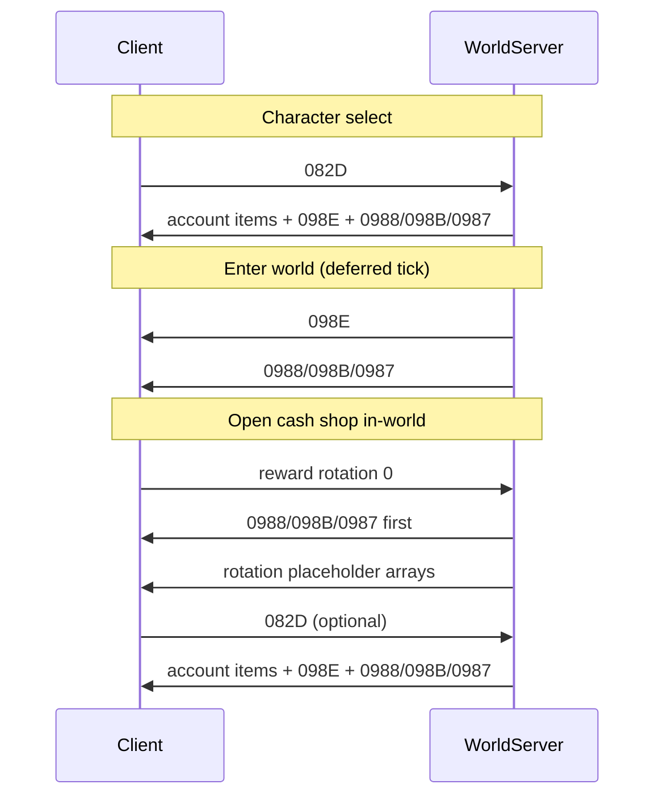

# Storefront "Catalogue Unavailable" — Investigation Findings

**Status:** Implemented (server + local launch path); latest native category-tree root fix is live-log verified for browse, while retrieve/purchase clicks remain action-gated
**Symptom:** WildStar client dialog *Something went wrong somewhere* / *Catalogue Unavailable* when opening the in-game store or account inventory.  
**Client enum:** `CodeEnumStoreError.CatalogUnavailable` (`0`) via opcode `0x098A` (`StoreError` event).  
**Last updated:** 2026-05-31

## Summary

Multiple failure modes were investigated across client launch, world packet order, catalog wire shape, STS, packed client Lua, and native category-tree construction. A fresh rebuilt World/STS pass showed the browse-side catalog and account-inventory packets reaching the client without the previous STS/catalog errors, yet Lua still raised `CatalogUnavailable`. The final browse-side root cause was semantic: NexusForever rebased visible children of hidden category `26` to parent `0`, while native `StorefrontLib.GetCategoryTree()` selects top-level categories by the hidden retail root category id (`26` locally, or `51` on the alternate signature path) from `GameFormula` data. That made `GetCategoryTree()` return an empty table after an otherwise valid `0x0988`/`0x098B`/`0x0987` catalog. Fresh patched World PID `42692` now sends those root tabs as children of `26` and the latest client log has no catalog/store/malformed errors. The remaining action-gated proof is a live `ClientAccountItemTake` and `ClientStorefrontPurchase*` click after relaunching against the patched world.

| Layer | Cause | Fix | Proof |
| --- | --- | --- | --- |
| **Client launch / banners** | Local launcher hardcoded `realmDataCenterId 9` (retail NA row with dead `StoreBannerDataUrlTemplate`); row `6` avoids the dead host but leaves `RequestBanners()` with no feed | Configurable `RealmDataCenterId`, default **`6`**; stock-client `-StoreBannerMode HostsRedirect` uses row **`9`** plus hosts/DNS redirect; custom-files clients can use the loose `RealmDataCenter.tbl` override | Client log `malformed store banner data: 80072ee7`; `RealmDataCenter.tbl.sql` rows 4 vs 6; packed `Storefront.lua` `SetupFeatured()` one-banner fallback |
| **World server (catalog timing)** | Catalog deferred to a later event tick after `082D`; client tied `StoreCatalogReady` to the request response | Send catalog synchronously in `SendCatalogResponse`; gate only when pregame packets or player loading are not ready | World log showed `(catalog deferred)` then catalog packets one tick later |
| **World server (0989 loop)** | `0x0989` plus full catalog on bootstrap/store hooks made the client spam `0x082D`; repeat `082D` responses also sent `0x0989` | `0x082D` always answered with `0x0988`→`0x098B`→`0x0987` only; never prepend `0x0989` on `HandleCatalogRequest` | World log showed many `082D` bursts per store open |
| **World server (timing)** | Post-login dirty/duplicate catalog lifecycle invalidated or confused the pregame catalog; store open sent rotation index 0 before `082D` catalog finished | Send one deferred clean in-world bootstrap after `ServerPlayerCreate` without `0x0989`; send catalog before rotation index 0 packets on store open | Decompile: `0x0987` dispatches `StoreCatalogReady`/`StoreLinksRefresh`; post-patch live log confirms in-world replay after prior pregame delivery |
| **World server (fortune storefront path)** | Current in-game store open sent `ClientFortuneNotifyStorefront` and `ClientFortuneNotifyGame`, not `0x082D`; old handler sent only fortune rewards/cards | `ClientFortuneNotifyStorefrontHandler` now sends account inventory, purchase history, and full catalog before fortune status | Live log `NexusForever.WorldServer_20260531_34216.log` showed no catalog after storefront notify; focused handler test passes and fresh World PID `41472` had patched handler registered |
| **Storefront category tree root** | Client parsed the catalog but `GetCategoryTree()` filtered top-level categories by hidden root parent id `26`; NexusForever had rebased those categories to parent `0` | Preserve original `store_category.parentId` for visible rows while still omitting hidden rows | Decompile `StorefrontLib.GetCategoryTree` (`1404eae60`) filters categories by root id from `GameFormula 0x528`; live patched log `NexusForever.WorldServer_20260531_42692.log` sends root tabs as `76->26`, `50->26`, `27->26`, etc. |
| **World server (catalog packets)** | Initial catalog ended with `ServerStoreCatalogUpdated` (`0x0989`), which retail treats as dirty | Initial response: `0x0988` → `0x098B` → `0x0987` only; reserve `0x0989` for real refreshes | Decompile `Storefront_HandleStoreCatalogUpdated`; live logs showed no `0989` after fix |

For local emulator sessions, **restart the world server and relaunch the client** after pulling these changes. A running WildStar process keeps the old `realmDataCenterId` and connector bits until exit.

---

## Primary root cause — realm data center row (client)

### Evidence

Extracted client table `wildstar_client.RealmDataCenter` (`wildstar_client_mysql/RealmDataCenter.tbl.sql`):

| ID | `authServer` | `storeBannerDataUrlTemplate` | Use |
| --- | --- | --- | --- |
| **6** | `localhost` | *(empty)* | Local / offline emulator row |
| **9** | `auth.na.wildstar-online.com` | `http://static.wildstar-online.com/banners/` | Retail NA row (host retired) |

Local launch paths previously passed `/realmDataCenterId 9` (hardcoded in `NexusForever.ClientConnector` and `Start-NexusForeverLocal.ps1`). The client then tried to load store banner data from the dead retail static host. Client error logs reported:

```text
malformed store banner data: 80072ee7
```

`80072ee7` is the Windows HRESULT for **WININET_E_NAME_NOT_RESOLVED** (hostname could not be resolved), consistent with fetching a defunct retail CDN URL.

The storefront UI surfaces this as the generic **Catalogue Unavailable** path even when the world server later sends a valid catalog (`0x0988` / `0x098B` / `0x0987`).

### Implemented fix

- `Source/NexusForever.ClientConnector/Configuration/ClientConfiguration.cs` — `RealmDataCenterId` property, default **`6`**.
- `Source/NexusForever.ClientConnector/Program.cs` — builds `/realmDataCenterId {id}` from config (fallback `6` if unset/invalid).
- `Tools/Setup/Start-NexusForeverLocal.ps1` — `-RealmDataCenterId` parameter (default **`6`**), written into staged `Client64\config.json` and direct `WildStar64.exe` fallback argv.

Operational notes: `Tools/Setup/README.md` documents the parameter, banner URL mismatch, stock-client hosts redirect, and local loose-table override. After `dotnet build` for ClientConnector, restage the connector into the WildStar `Client64` folder and ensure `config.json` contains the intended `RealmDataCenterId` before the next launch. The restored local banner feed is served by `NexusForever.WorldServer` at `/banners/data.json`; stock clients need `-StoreBannerMode HostsRedirect` so row 9's `http://static.wildstar-online.com/banners/` URL resolves locally, while custom-files clients can load the staged `Data\DB\RealmDataCenter.tbl` override and request `http://localhost:5000/banners/`.

### Falsification test

1. Launch stock client with `-StoreBannerMode HostsRedirect`: store/account inventory should open without banner fetch errors and should request the local `/banners/data.json` feed through `static.wildstar-online.com`.
2. Launch custom-files client with `-StoreBannerMode LooseData`: store/account inventory should open without banner fetch errors and should request `http://localhost:5000/banners/data.json`.
3. Launch with `-RealmDataCenterId 9 -StoreBannerMode None`: should reproduce `malformed store banner data: 80072ee7` and catalogue fallback (only use when intentionally testing retail row behavior).

---

## Secondary — world server catalog request timing

### Evidence

`CharacterListManager` comment (retail-aligned): *"Retail can request the storefront before the character query completes."*

Live world log (account 1, character select):

1. `ClientStorefrontRequestCatalog` (`0x082D`) received.
2. Handler deferred: `characterListPacketsSent=False`.
3. Many lines of async character/equipment work.
4. `ServerCharacterList` sent.
5. Catalog response finally sent (full categories/offers/finalise).

The client issued `082D` immediately after pregame packets (`0x0966`, `0x0968`, `0x097F`, …) but the server waited for the full character DB load. That gap is long enough for the UI to fail with **Catalogue Unavailable** before the server responds.

### Implemented fix

- `IWorldSession.HasSentPregameAccountPackets` — set `true` when `SendPregameAccountPackets` completes in `CharacterListManager.QueueCharacterListPackets`.
- `ClientStorefrontRequestCatalogHandler.CanProcessCatalogRequest` — requires `HasSentPregameAccountPackets` and, if `Player != null`, `!Player.IsLoading`. Does **not** require `HasSentCharacterListPackets`.

Catalog handler still sends account inventory via `InventoryManager.SendInitialPackets()` then `StorePurchaseHistoryManager` + `GlobalStorefrontManager.HandleCatalogRequest`.

---

## Secondary — initial `ServerStoreCatalogUpdated` (`0x0989`)

### Evidence

Decompile (`INITIAL_FINDINGS.md`, storefront `0x0987..0x0991` section):

- `Storefront_HandleStoreCatalogUpdated` (`14044cf40`) marks the catalog dirty; it is not a success completion.
- Historical NexusForever `HandleCatalogRequest` enqueued `ServerStoreCatalogUpdated` before categories/offers/finalise.

Live logs **after** removing `0989` from the initial response still showed a healthy catalog (`30` categories, `348` offer groups, `478` offers, `1301` item rows) ending in `ServerStoreFinalise` only. Server-side packet shape and DB content were not the blocker once client banner fetch was fixed.

### Implemented fix

`GlobalStorefrontManager.HandleCatalogRequest`:

1. `ServerStoreCategories` (`0x0988`)
2. `ServerStoreOffers` (`0x098B`, 20 groups per packet)
3. `ServerStoreFinalise` (`0x0987`) — **no** `ServerStoreCatalogUpdated` on first open

---

## What the server sends when healthy

From `StorefrontCatalogDiagnostics` on a seeded world DB (`laughingws_store_catalog_seed.sql`):

- Pregame: `ServerAccountCurrencySet`, entitlements, tier (character list flow).
- On catalog request: account item cache/list, pending clear, cooldowns, daily login, purchase history ready.
- Store: categories → offer batches → finalise.

No `ServerStoreError` with `CatalogUnavailable` is emitted by current server purchase handlers; the UI string comes from the client-side `StoreError` event mapping.

---

## Verification checklist

### Build

```powershell
dotnet build Source\NexusForever.ClientConnector\NexusForever.ClientConnector.csproj -v minimal --nologo
dotnet build Source\NexusForever.WorldServer\NexusForever.WorldServer.csproj -v minimal --nologo
dotnet test Source\NexusForever.Game.Tests\NexusForever.Game.Tests.csproj -v minimal --nologo --filter "FullyQualifiedName~Storefront|FullyQualifiedName~CharacterListManagerTests.QueueCharacterListPackets"
```

### Launcher script parse

```powershell
powershell -NoProfile -Command "& { $null = [System.Management.Automation.Language.Parser]::ParseFile('Tools/Setup/Start-NexusForeverLocal.ps1', [ref]$null, [ref]$errors); if ($errors) { $errors; exit 1 } }"
```

### Runtime

1. Restart the local stack (`Restart-NexusForeverLocal.ps1` or full `Start-NexusForeverLocal.ps1`).
2. **Exit any running WildStar process**; for stock clients launch with `-StoreBannerMode HostsRedirect` and verify `Client64\config.json` uses `RealmDataCenterId: 9`. For custom-files clients, `-StoreBannerMode LooseData` can keep `RealmDataCenterId: 6`.
3. Open store from character select and in-world; confirm no `malformed store banner data` in `Errors\WildStar64*.log`.
4. World log: catalog should start soon after `082D` with `pregameAccountPacketsSent=True`, without waiting for `ServerCharacterList`.

### World DB sanity (empty catalog guard)

```sql
SELECT COUNT(*) FROM store_category;
SELECT COUNT(*) FROM store_offer_group;
```

Counts should be non-zero when `laughingws_store_catalog_seed.sql` was imported via setup.

---

## Related code and references

| Artifact | Role |
| --- | --- |
| `Source/NexusForever.Game.Static/Storefront/StoreError.cs` | `CatalogUnavailable = 0` |
| `Source/NexusForever.WorldServer/.../ClientStorefrontRequestCatalogHandler.cs` | Catalog request orchestration |
| `Source/NexusForever.Game/Storefront/GlobalStorefrontManager.cs` | Catalog packet cache and send order |
| `Source/NexusForever.GameTable/Model/RealmDataCenterEntry.cs` | `StoreBannerDataUrlTemplate` field |
| `wildstar_client_mysql/RealmDataCenter.tbl.sql` | Extracted realm rows |
| `Decomp/Analysis/INITIAL_FINDINGS.md` | Storefront opcode consumer notes (`0x0987`–`0x0991`) |
| `Tools/Setup/README.md` | Local launch + `RealmDataCenterId` override |

---

## Regression (2026-05-30 follow-up)

`ClientStorefrontRequestCatalogHandler` briefly required `HasSentCharacterListPackets`, a non-null `Player`, and `!Player.IsLoading` before answering `0x082D`. That blocked **character-select** store and account inventory (no player yet) and could defer in-world opens until after a long async character DB load. The handler was corrected again to match the table above: gate on `HasSentPregameAccountPackets` only, defer when `Player != null && Player.IsLoading`, and call `InventoryManager.SendInitialPackets()` on every catalog response.

### Confirmed wire-format root cause (client logs 2026-05-30)

With `realmDataCenterId 6`, world logs showed a full `0x0988` → `0x098B` → `0x0987` catalog, but WildStar still logged:

- `Malformed Packet: unPackFromStreamFn failure : <2440` (`0x0988` `ServerStoreCategories`)
- then `<2443` (`0x098B` `ServerStoreOffers`) and `Invalid Message Id #988` (stream desync)

Ghidra readers (`Server0x098F_ReadPayload` @ `1400a1230`, `ServerStoreOffers_Offer_ReadPayload` @ `1400a0dc0`):

| Field | Client reads | Buggy server write (May 2026 packet rename) |
| --- | --- | --- |
| Nested currency row `CurrencyType` | **32-bit** `uint32` | `writer.Write(CurrencyType)` → **64-bit** enum |
| Offer `field_7` @ `+0x30` | **8 bits** via `FUN_14006be30` @ `1400a0dc0` | `writer.Write(byte)` (8 bits); do not use `Write(ulong)` |
| Offer prices @ `+0x18` (8 bytes) | `FUN_140337160` @ `1400a0dc0` | Sequential `Write(float)` ×2 (misaligns after wide strings) |
| Group category id/index arrays | `FUN_140337160` ×2 @ `1400a0fa0` | Sequential `Write(uint)` loops |

Three currency packages at 64 bits each put the client **96 bits** past the real `0x0988` tail, which explains `2440` and the follow-on `098B` / `#988` errors even when the catalog DB and handler timing are correct.

**Fix:** emit nested currency rows through `ServerStoreCurrencyPackageRow` (32-bit tail), write offer `field_7` as `byte RetailCatalogWireByte` (8 bits via `FUN_14006be30`, not `ulong`), encode offer prices with `WriteRetailCompositeByteSpan` (8 bytes) and category arrays with `WriteRetailCompositeUInt32Array` per Ghidra `1400a0dc0` / `1400a0fa0`. Startup validation must use the same composite reads in `RetailStoreOffersWireReader` (sequential float/uint reads falsely pass).

## In-world StoreCatalogReady replay (2026-05-31)

Live world log showed **two** full catalog passes per login:

1. Character-select `0x082D` (`player=0`) → full `0x0988`/`0x098B`/`0x0987`
2. World login → `0x0989` + the same full catalog again inside / right after the login burst

That matched a broken client state: Featured tiles visible, then *Catalogue Unavailable*, with no
`Malformed` lines at `logDefaultLevel 4`.

Mitigation:

- Character-select `0x082D` sends account inventory + `0x098E` + full catalog synchronously so
  character-select store/account-inventory opens can still complete `StoreCatalogReady`.
- After world login, `Player.SendDeferredInWorldStorefrontCatalog` (next event tick) sends purchase
  history and a clean full bootstrap catalog so the active in-world UI layer receives
  `StoreCatalogReady` / `StoreLinksRefresh` after `ServerPlayerCreate`.
- In-world repeat `0x082D` sends account inventory + `0x098E` + catalog without `0x0989`.
- Catalog delivery remains keyed by **account id** for diagnostics, but pregame delivery no longer
  suppresses the deferred in-world ready replay.

### Defer catalog out of login bursts

- World bootstrap catalog defers one tick after `SendPacketsAfterAddToMap` (not in the
  `ServerPlayerCreate` burst).
- `0x082D` responses remain synchronous because the client ties `StoreCatalogReady` to that request.
- Do not reintroduce `0x0989` for this bootstrap. `0x0989` is a dirty notification; the replay is
  `0x0988` → `0x098B` → `0x0987` only.

## Deep analysis — why the dialog still appears (2026-05-31)

### What “Catalogue Unavailable” actually is

The string is **not** sent by NexusForever world code today. It is the Lua label for `CodeEnumStoreError.CatalogUnavailable` (`0`), shown when the client storefront UI decides the catalog is not usable.

Packed client UI extraction (local `Nexus.Archive` reader over `I:\WildStar\Patch\ClientData.index`) found 203 Lua files and 558 XML files in `ClientData.archive`. The relevant source is not loose on disk, but it is extractable through the archive API:

- `UI\ProtectedAddons\Storefront\Storefront.lua`
  - line 41 maps `StorefrontLib.CodeEnumStoreError.CatalogUnavailable` to `Storefront_ErrorCatalogUnavailable`.
  - lines 147-149 register `StoreCatalogReady`, `StoreError`, and `StoreCatalogUpdated`.
  - lines 436-441 show `OnOpenStore()` requesting catalog when `StorefrontLib.IsStoreReady()` is false or `IsStoreCatalogDirty()` is true.
  - lines 949-953 call `OnStoreError(CatalogUnavailable)` when `StorefrontLib.GetCategoryTree()` is empty after a ready/update path.
- `UI\AccountInventory\AccountInventory.lua` line 212 calls `GameLib.OpenAccountInventory()`, and the protected storefront addon also listens for `AccountInventoryWindowShow`, so account inventory shares the same native catalog/account-item readiness contract.

Native path (decompile):

1. Success: `0x0987` `ServerStoreFinalise` → `Storefront_DispatchStoreCatalogReady` → UI events `StoreCatalogReady` / `StoreLinksRefresh`.
2. Failure: `0x098A` `StoreError` (5-bit enum) → client event `StoreError` → Lua maps enum to the dialog text.
3. No dedicated native function emits “CatalogUnavailable” by name; the UI or Lua layer maps **local** failure to enum value `0`.
4. Category-tree build: `StorefrontLib.GetCategoryTree` (`1404eae60`) iterates the category cache and selects roots where `ParentCategoryId` equals the root category id loaded from `GameFormula` entry `0x528` (`26` on this local non-signature path, `51` on the alternate signature path). Parent `0` categories are not returned as store roots.

So “Catalogue Unavailable” means: **the client never reached a stable `StoreCatalogReady` for the open you care about**, not “the server returned error packet 098A with value 0” (purchase handlers can emit other `StoreError` values; catalog open does not).

### Confirmed failure modes (ranked)

| Priority | Mechanism | Evidence | Emulator status |
| --- | --- | --- | --- |
| **P0** | **Packet order / timing** — store UI opens on reward rotation index `0` **before** `0x082D` catalog finishes | World log: rotation `0` ~6982, `082D` + full catalog ~7098–7155 | **Mitigated in source** — send catalog on rotation `0` before placeholder arrays; user must run **latest** world DLL |
| **P0** | **Fortune storefront native open path** — latest in-game open emitted `ClientFortuneNotifyStorefront` and `ClientFortuneNotifyGame` but no `0x082D`; the server responded only with `ServerFortuneRewards` / `ServerFortuneCards`, leaving Lua with an empty category tree | World log `NexusForever.WorldServer_20260531_34216.log` around the `20:55` store action; no catalog/account-inventory packets followed the storefront notify | **Implemented in source** — `ClientFortuneNotifyStorefrontHandler` sends account inventory, purchase history, and full catalog before fortune status |
| **P0** | **Native category-tree root mismatch** — server sent visible top-level categories with parent `0`, but `GetCategoryTree()` only returns categories whose parent is the retail hidden root id (`26` locally) | Fresh rebuilt world log sent clean catalog with no client malformed packet, yet Lua still showed `CatalogUnavailable`; decompile of `1404eae60` proves the parent-id filter | **Implemented in source** — visible categories preserve original `store_category.parentId` values, so root tabs remain children of hidden `26` |
| **P0** | **`0x0989` dirty without reload** — login sent only `StoreCatalogUpdated`, invalidating char-select catalog until a late `082D` | World log line ~4727–4728: `notifying in-world catalog dirty` + `0989`, no `0988` in that burst | **Fixed in source** — no dirty notify; post-`ServerPlayerCreate` bootstrap sends full `0988`→`098B`→`0987` without `0989` |
| **P0** | **`0x0989` + catalog on `082D` loop** — server answered `082D` with `0989` when catalog already delivered → client spammed `082D` → UI freeze / blur | Many `082D` lines per store open in earlier session | **Fixed** — `HandleCatalogRequest` never prepends `0989` |
| **P1** | **Wire parse desync** on `0x0988` / `0x098B` (`Malformed` `<2440>` / `<2443>`) | Client logs 2026-05-30; Ghidra 32-bit currency, composite price arrays; local DB scan 2026-05-31 loaded 348 groups / 478 offers with no wire-limit violations | **Fixed for current DB/code** (`ServerStoreCurrencyPackageRow`, `WriteRetailComposite*`, startup `RetailStore*WireReader`, `Tools/StorefrontWireValidate --scan-db`) |
| **P1** | **Banner fetch** — `realmDataCenterId 9` → dead `storeBannerDataUrlTemplate` → `malformed store banner data: 80072ee7`; `realmDataCenterId 6` → no feed and one fallback splash banner | Client + `RealmDataCenter.tbl.sql` + packed `Storefront.lua` | **Fixed** for stock clients through `-StoreBannerMode HostsRedirect`; restored for custom-files clients through local `/banners/data.json` + loose `RealmDataCenter.tbl` |
| **P2** | **STS `operation 20021` / native STS crash** — `IStsUniTxn EStsConnErr 42` appeared in earlier runs; latest run crashes in `StsConnLib64.MT` after catalog delivery | Client log `Using NCPlatform address ... 127.0.0.1:6600`; tx id `0x15` maps to Auth `KeyData` and Presence `Reversed` depending on service; native parsers require non-empty identity data and non-zero `UserCenter` | **Implemented in source** — harden Auth user-info/login-finish/token replies and Presence login/user-info/no-op replies; make STS file logging deploy reliably |
| **P3** | **Catalog in the login burst** — full catalog emitted while the client was still applying `ServerPlayerCreate` could be dropped or mis-applied | Earlier live log showed post-create catalog/dirty traffic inside the login packet burst | **Fixed in source** — deferred world bootstrap runs one event tick later and omits `0x0989` |

### Healthy server sequence (target)



### What the latest world log proved

- Catalog **is** present: 30 categories, 348 groups, 478 offers, 1301 item rows; `StorefrontWireValidate` rules pass in code.
- In-world `082D` **does** complete with `(catalog sent)` and `refresh=False` (no `0989` on answer).
- Fresh post-relaunch failure after that delivery was explained by category semantics: source emitted visible root tabs with `ParentCategoryId=0`, but native `GetCategoryTree()` roots under hidden parent id `26`.
- Failure is therefore **client state / category semantics**, not “empty DB” or “handler never runs”.

2026-06-01 follow-up after the store became browsable: the category tree and banner loaded, but the Featured grid showed only Battlesworn and Mounts showed no products. Server diagnostics and SQL proved the world still sent Mounts (`31`) with 72 visible offer groups / 140 offer rows, plus Ground Mounts (`33`) and Hoverboards (`32`). The surviving Battlesworn row was the clue: `OfferItemPrice.Build()` negated every non-zero `store_offer_item_price.expiry`, so imported negative LaughingWS active-window values such as `-1016071787` were emitted as positive expired scalars. Retail semantics are modeled as the DB storing the wire value directly: `expiry <= 0` is currently active and `expiry > 0` is expired. The LaughingWS seed and local DB were normalized so all current catalog rows are active (`1995405795` source rows became `-1995405795`), while runtime now emits the stored value unchanged so deliberately positive rows can expire as retail did.

## Remediation plan (to browse store + account inventory reliably)

### Phase 0 — Deploy and verify (required)

1. Restart auth/world after building `NexusForever.WorldServer` (confirm log line `sending in-world bootstrap catalog ... after prior catalog delivery so the in-world UI receives StoreCatalogReady` when character-select catalog already completed).
2. Full exit WildStar; for stock clients confirm `I:\WildStar\Client64\config.json` has `"RealmDataCenterId": 9` when using `-StoreBannerMode HostsRedirect`.
3. One store open; grep world log for:
   - `sending catalog before reward rotation index 0`
   - one deferred post-create catalog replay, then one catalog response per explicit store open.
4. Grep client `Errors\WildStar64*.log` for `Malformed`, `2440`, `2443`, `banner`.

### Phase 1 — Catalog delivery contract (server, in progress)

| Task | Owner | Done when |
| --- | --- | --- |
| Never emit `0989` on `HandleCatalogRequest` | World/Game | No `0989` between `082D` start/end in log |
| Post-create bootstrap replays in-world ready after pregame delivery | `Player.SendDeferredInWorldStorefrontCatalog` / `GlobalStorefrontManager.SendBootstrapCatalogPacketsIfNeeded` | Log shows deferred `0988`→`098B`→`0987` after `ServerPlayerCreate`, with no leading `0989` |
| Store open: catalog before rotation index `0` | `ClientRewardUpdateRequestHandler` | Log shows catalog lines **before** rotation `0` sends |
| Store open: fortune storefront notify also refreshes catalog contract | `ClientFortuneNotifyStorefrontHandler` | Log shows `storefront notify request ... sending account inventory, purchase history, and catalog before fortune status` followed by account inventory, purchase history, catalog, then fortune packets |
| Category tree preserves retail hidden root | `GlobalStorefrontManager.BuildStoreCategories` | Visible top-level categories keep `ParentCategoryId=26`; `StorefrontLib.GetCategoryTree()` no longer receives parent `0` roots |
| Bootstrap when no pregame catalog was delivered | `GlobalStorefrontManager.SendBootstrapCatalogPacketsIfNeeded` | Log shows one deferred `0988`→`098B`→`0987`, no leading `0989` |
| Keep `0x082D` synchronous | `ClientStorefrontRequestCatalogHandler` | `082D` response sends inventory/`098E` then catalog before returning |

### Phase 2 — Wire and DB certainty

```powershell
dotnet run --project Tools\StorefrontWireValidate\StorefrontWireValidate.csproj -- --scan-db --connection="Server=127.0.0.1;User ID=bankai;Password=bankai;Database=nexus_forever_world"
```

```sql
SELECT COUNT(*) FROM store_category;
SELECT COUNT(*) FROM store_offer_group;
```

If `--scan-db` fails or counts are zero, fix seed/import before any more UI debugging.

2026-05-31 local result:

```text
Loaded 348 visible offer groups (478 offers).
OK   no database wire-limit violations found.
```

### Phase 3 — STS hardening (implemented)

Client logs show NCPlatform using `127.0.0.1:6600`. Earlier runs ended with `IStsUniTxn EStsConnErr 42 for operation 20021`; the latest rebuilt-world run delivered the catalog successfully, then crashed in `StsConnLib64.MT`.

The transaction id is service-relative:

- `StsConn_GetTransactionName` maps Auth transaction id `0x15` to `KeyData`.
- `StsConn_GetPresenceTransactionName` maps Presence transaction id `0x15` to `Reversed`.

The operation log only prints `20021`, so the source-side fix covers both plausible STS edges instead of assuming one service table. Native STS parsers also require account-shaped fields (`UserId`, non-zero `UserCenter`, `UserName`, and related identity/status fields) on Auth/Presence user-info style replies.

Implemented STS coverage:

- `/Auth/LoginFinish` and `/Auth/ConsumeGameToken` now return a non-zero `UserCenter`.
- `/Auth/GetUserInfo` and `/Auth/GetMyUserInfo` return account-shaped replies (`UserId`, `UserCenter`, `UserName`, `LoginName`, `UserStatus`, `Created`).
- `/Auth/PageVerifiedIps` returns an empty successful page with `TotalPage`, `TotalCount`, and an `Items type="array"` element.
- `/Auth/UnregisterVerifiedIp` accepts the native request shape and returns success.
- `/Presence/Login` and `/Presence/GetUserInfo` return account-shaped `Reply` data (`UserId`, `UserCenter`, `UserName`, `LoginName`, `UserStatus`, `Created`, `Aliases`).
- `/Presence/Reversed`, `/Presence/SetAppData`, `/Presence/Logout`, `/Presence/SendUserInfo`, `/Presence/XferRequest`, and `/Presence/XferPresences` return success-shaped empty `Reply` payloads.
- `NexusForever.StsServer.csproj` now always copies `nlog.config`; the running bin config had a stale console-only copy, which hid STS file logs.
- Re-test target: no `EStsConnErr 42`, no `StsConnLib64.MT` crash, and store/account inventory behavior should depend on world catalog/account-item packets rather than a missing NCPlatform transaction.

#### Follow-up STS blocker: verified IP page

After rebuilding and restarting STS/World, the old malformed catalog and banner errors were gone, and World sent a healthy full catalog on store open. The remaining client error was:

```text
IStsUniTxn EStsConnErr 42 for operation 20021
```

Fresh STS file logging showed the missing cause directly: the client repeatedly requested `/Auth/PageVerifiedIps`, and the server had no handler.

Mapped native evidence:

- `StsConnLib64.MT.dll` maps Auth transaction id `0x5F` to `PageVerifiedIps` and `0x60` to `UnregisterVerifiedIp`.
- `WildStar64.exe` `14003b4f0` builds a `PageVerifiedIps` request with `PageIndex`, `PageSize`, and `UserId`.
- `WildStar64.exe` `14003b220` parses the reply and requires `TotalPage`, `TotalCount`, and an `Items` element. Each optional item can carry `NetAddress`, `Registered`, and `Expired`; an empty `Items type="array"` page is valid.
- `WildStar64.exe` `14003c5a0` builds `UnregisterVerifiedIp` with `UserId` and repeated `NetAddresses/NetAddress`.

Implemented behavior is intentionally conservative: the emulator has no verified-IP persistence, so it returns an empty successful page and accepts unregister as a no-op success. Post-fix STS log `NexusForever.StsServer_20260531_17388.log` registered 20 handlers and handled `/Auth/PageVerifiedIps` at `18:38:22` with `200 OK`.

### Phase 4 — Account inventory parity

Account inventory uses the same `082D` + account item packets (`0966`/`0968`/`0977`/…) path as the store. Confirm:

- `SendInitialPackets()` on every catalog response (already in handler).
- Account item types in log (`180`, `612`) exist in `AccountItem.tbl` / DB — invalid rows can break UI before catalog matters.

2026-05-31 follow-up log `NexusForever.WorldServer_20260531_5564.log` confirms the browse-side account inventory path after the STS verified-IP fix: `ClientStorefrontRequestCatalog` at `18:38:23` sent 18 account item rows through `ServerAccountItemCacheListAppend` and `ServerAccountItems`, cleared empty pending rows, sent `ServerAccountItemCooldowns`, then sent `ServerStorePurchaseHistoryReady` before catalog packets. No retrieve/claim or purchase click was captured in that live pass, so those remain action-gated even though their handlers and focused tests pass.

2026-05-31 post-patch log `NexusForever.WorldServer_20260531_32628.log` confirms the current browse-side account inventory path again: character-select `ClientStorefrontRequestCatalog` at `19:02:08` sent 20 account item rows, `ServerAccountItemCacheListAppend`, `ServerAccountItems`, pending clear, cooldowns, purchase history ready, and a clean full catalog. No live `ClientAccountItemTake` or `ClientStorefrontPurchase*` packet was captured in that pass.

### Phase 5 — Evidence closure

| Gate | Pass criteria |
| --- | --- |
| Char-select store | Opens without dialog; no `Malformed` in client log |
| In-world store | Opens without dialog; ≤2 catalog completions per login |
| Account inventory | Opens; items list populated |
| Regression | No `0989` storm; no blurred modal lock |

Post-patch live pass (`NexusForever.WorldServer_20260531_32628.log`) reached the browse-side gates from the server perspective: account inventory packets were sent at character select and again in-world, the in-world bootstrap replay fired after `ServerPlayerCreate`, store open sent catalog before reward rotation index `0`, and no real `ServerStoreError`, `Malformed`, `Exception`, or `ERROR` was logged after the live store action. `I:\WildStar\Logs\WildStar64_16042_DAN_260531_204834.txt` has no `Catalogue`, `Catalog`, `Malformed`, `2440`, `2443`, `EStsConnErr`, `banner`, or `Store` hits after the `21:02` live session; only older disconnect/reconnect noise and a missing disconnect icon were present.

### 2026-05-31 local verification

- `dotnet build Source\NexusForever.WorldServer\NexusForever.WorldServer.csproj --no-restore -v minimal --nologo` — passed.
- `dotnet build Source\NexusForever.StsServer\NexusForever.StsServer.csproj --no-restore -v minimal --nologo` — passed.
- `dotnet test Source\NexusForever.Game.Tests\NexusForever.Game.Tests.csproj --no-restore -v minimal --nologo --filter "FullyQualifiedName~StorefrontCatalogTests"` — 27 passed after the in-world replay change.
- `dotnet test Source\NexusForever.Game.Tests\NexusForever.Game.Tests.csproj --no-restore -v minimal --nologo --filter "FullyQualifiedName~StsResponseSerializationTests"` — 2 passed.
- `dotnet test Source\NexusForever.Game.Tests\NexusForever.Game.Tests.csproj --no-restore -v minimal --nologo --filter "FullyQualifiedName~StsResponseSerializationTests|FullyQualifiedName~StorefrontCatalogTests|FullyQualifiedName~StorefrontPurchaseHandlerTests|FullyQualifiedName~AccountItemHandlerTests|FullyQualifiedName~AccountRuntimeEvidenceTests|FullyQualifiedName~AccountTerminalHandlerTests|FullyQualifiedName~VirtualCurrencyPackageHandlerTests"` — 51 passed after adding verified-IP STS serialization coverage.
- `dotnet test Source\NexusForever.Game.Tests\NexusForever.Game.Tests.csproj -v minimal --nologo --filter "FullyQualifiedName~Storefront|FullyQualifiedName~Reward|FullyQualifiedName~AccountItemHandlerTests|FullyQualifiedName~AccountInventoryPendingGroupTests"` — 173 passed.
- `dotnet test Source\NexusForever.Game.Tests\NexusForever.Game.Tests.csproj -v minimal --nologo --filter "FullyQualifiedName~AccountItemCooldownTests|FullyQualifiedName~CREDDExchangeHandlerTests|FullyQualifiedName~StorefrontPurchaseHandlerTests|FullyQualifiedName~AccountInventoryPendingGroupTests|FullyQualifiedName~AccountItemHandlerTests|FullyQualifiedName~AccountRuntimeEvidenceTests|FullyQualifiedName~AccountTerminalHandlerTests|FullyQualifiedName~VirtualCurrencyPackageHandlerTests|FullyQualifiedName~StorePurchaseVelocityLimiterTests|FullyQualifiedName~StorefrontCatalogTests|FullyQualifiedName~ClientStorefrontRequestCatalogHandlerTests"` — 75 passed.
- `dotnet run --project Tools\StorefrontWireValidate\StorefrontWireValidate.csproj -- --scan-db --connection="Server=127.0.0.1;User ID=bankai;Password=bankai;Database=nexus_forever_world"` — passed, 348 visible groups / 478 offers / no wire-limit violations.
- Normal builds initially failed while live `NexusForever.StsServer.exe` / `NexusForever.WorldServer.exe` held output DLLs; after stopping them, rebuilding, and restarting, fresh PIDs were `38616` (STS) and `39364` (World).
- STS file logging is now active at `Source/NexusForever.StsServer/bin/Debug/net10.0/logs/NexusForever.StsServer_20260531_38616.log`; startup registered 18 message factories/handlers and is listening on `0.0.0.0:6600`.
- World startup completed at `Source/NexusForever.WorldServer/bin/Debug/net10.0/logs/NexusForever.WorldServer_20260531_39364.log`; it is listening on `0.0.0.0:24000` and `http://0.0.0.0:5000`.
- Follow-up verified-IP build/restart passed: STS PID `17388` registered 20 message factories/handlers, World PID `5564` started, and STS handled `/Auth/PageVerifiedIps` with `200 OK`.
- Follow-up world log `NexusForever.WorldServer_20260531_5564.log` sent the full catalog at `18:38:30`: 30 categories, 348 offer groups, 478 offers, 1301 item rows, `ServerStoreCategories`, 18 `ServerStoreOffers`, then `ServerStoreFinalise`.
- Follow-up client log after the `20:38:21` reconnect no longer shows a new `EStsConnErr 42`, `Malformed`, `2440`, `2443`, or banner error through the captured tail; player action verification for browse/retrieve/purchase remains the final gate.
- Post-patch restart via `Restart-NexusForeverAuthWorldLocal.ps1 -RepoRoot I:\GIT\NexusForever -SkipClientLaunch -WaitTimeoutSeconds 180` passed: Auth PID `15844`, reused STS PID `17388`, World PID `32628`.
- Post-patch world log `NexusForever.WorldServer_20260531_32628.log` confirmed character-select `082D` catalog/account inventory, in-world bootstrap replay after prior catalog delivery, catalog before reward rotation `0`, and no real store/catalog error lines after the live store action.
- A later quick launch with stale mixed prerequisite assemblies failed World startup with `ReflectionTypeLoadException` / `PrerequisiteParameters.get_Item` missing. Rebuilding `NexusForever.Game` and `NexusForever.WorldServer` fixed the source/output mismatch, and the launcher now builds when `-SkipSetup` is used so future quick launches do not reuse out-of-sync runtime assemblies.
- Follow-up world log `NexusForever.WorldServer_20260531_34216.log` started cleanly on `0.0.0.0:24000`, with no `ReflectionTypeLoadException` or `get_Item` startup failure. The same pass sent account inventory + clean catalog at character select (`20:48:23`), in-world catalog before reward rotation `0` (`20:48:30`), and no `ServerStoreError` after the live store action. The client log tail through `22:48:40` still has no `Catalogue`, `Malformed`, `2440`, `2443`, `EStsConnErr`, banner, or store errors; only the known missing `UI_Disconnect_Icon.tex` asset line appeared. Live retrieve/purchase clicks remain uncaptured.
- Latest regression root cause: later in-game opens around `20:55` in `NexusForever.WorldServer_20260531_34216.log` sent `ClientFortuneNotifyStorefront` / `ClientFortuneNotifyGame`, not `ClientStorefrontRequestCatalog` or reward rotation index `0`. The server only sent `ServerFortuneRewards` / `ServerFortuneCards`, so the storefront Lua could still enter the local `CatalogUnavailable` path even though every previously mapped `0x082D` and rotation path was fixed.
- Implemented follow-up: `ClientFortuneNotifyStorefrontHandler` now sends account inventory initial packets, purchase history, and the full clean catalog before `FortuneSessionManager.SendStatus`. Focused verification passed with `dotnet test Source\NexusForever.Game.Tests\NexusForever.Game.Tests.csproj --no-restore -v minimal --nologo --filter "FullyQualifiedName~FortuneStorefrontHandlerTests|FullyQualifiedName~FortuneSessionManagerTests|FullyQualifiedName~StorefrontCatalogTests|FullyQualifiedName~ClientStorefrontRequestCatalogHandlerTests"` (42 passed), and `dotnet build Source\NexusForever.WorldServer\NexusForever.WorldServer.csproj --no-restore -v minimal --nologo` passed. Fresh patched Auth/World PIDs after manual restart are `35480` / `41472`; the broader restart script build was blocked by unrelated already-running Chat/Friendship/Group/Character service DLL locks.
- Fresh user retest against World PID `41472` still showed `Catalogue unavailable` even though the client logged no malformed storefront packets and the world sent full catalogs at character select, world bootstrap, and reward rotation `0`. Native `StorefrontLib.GetCategoryTree` (`1404eae60`) explains this final browse failure: it filters top-level category rows by hidden root parent id from `GameFormula 0x528` (`26` locally), while NexusForever was rebasing visible children of hidden category `26` to parent `0`. `GlobalStorefrontManager.BuildStoreCategories` now preserves original `store_category.parentId` values for visible rows.

## Resolution state

| Item | State |
| --- | --- |
| Configurable local `RealmDataCenterId` (default 6) | **Implemented** |
| Stock-client banner redirect mode | **Implemented** |
| Pregame-gated catalog response (no player/char-list gate) | **Implemented** |
| No initial `0x0989` on `HandleCatalogRequest` | **Implemented** |
| Post-create in-world ready replay after pregame delivery | **Implemented** |
| Post-create full catalog when no pregame catalog was delivered | **Implemented** |
| Catalog before rotation index `0` | **Implemented and live-verified in log** |
| Catalog before fortune storefront status | **Implemented and locally verified by focused test** — live client relaunch/store-open proof pending |
| Preserve native category-tree hidden root parent (`26`) | **Implemented** — live client relaunch/store-open proof pending |
| STS operation `20021` / native STS crash hardening | **Implemented and locally verified for `/Auth/PageVerifiedIps`** — no new `EStsConnErr 42` in the latest captured client tail |
| Catalog emitted inside login burst | **Fixed and live-verified in log** — deferred one event tick after `ServerPlayerCreate` |
| Live client confirmation after relaunch | **Partial local verification** — catalog/account-inventory browse packets reach the client without the prior STS/catalog errors; the latest fortune storefront path fix still needs a fresh relaunch/store open plus retrieve/purchase clicks |
