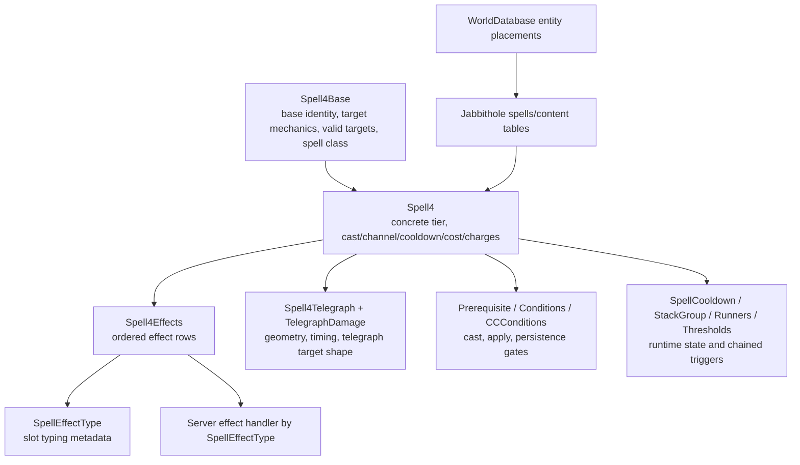

# Global Spell System Reverse Engineering

Date: 2026-05-14

This note captures the current structural and behavioral understanding of the WildStar/NexusForever global spell system from three local evidence sources:

- `all_wildstar_client_mysql.sql`: client gametable spell data.
- `all_jabbithole_mysql.sql`: Jabbithole spell/content relationship data.
- `I:\GIT\NexusForever.WorldDatabase`: optional sniff-derived world entity placements.
- NexusForever server code in `Source/NexusForever.Game`.

The important conclusion: spells are global, data-driven behavior graphs. A `Spell4Base` defines the stable base identity and targeting shape, `Spell4` defines a concrete tier/cast instance, `Spell4Effects` defines ordered effect nodes, and support tables add geometry, requirements, cast events, chained spells, cooldowns, stack behavior, and visuals. Effect handlers should therefore be restored by effect family, not spell by spell.

## Evidence Setup

I created a local MySQL database named `nexus_spell_re` using `bankai/bankai` and imported a focused subset of both root SQL dumps. A full import of the client dump was possible but inefficient because it spent a long time loading large localization tables before reaching spell tables; the focused import loaded the spell, prerequisite, property, telegraph, formula, location, and Jabbithole relationship tables needed for this analysis.

Direct row counts from the focused database:

| Table | Rows | Purpose |
| --- | ---: | --- |
| `spell4` | 66,383 | Tier/concrete spell rows |
| `spell4base` | 44,838 | Base spell rows |
| `spell4effects` | 131,010 | Ordered effect rows |
| `spell4telegraph` | 24,343 | Spell to telegraph links |
| `telegraphdamage` | 12,085 | Telegraph geometry/time rows |
| `spelleffecttype` | 150 | Per-effect metadata for data bit slots |
| `spellcooldown` | 202 | Cooldown records |
| `prerequisite` | 32,131 | Shared prerequisite expressions |
| `targetgroup` | 9,644 | Target group records |
| `gameformula` | 1,217 | Formula constants used by combat and scaling |
| `unitproperty2` | 200 | Unit property ids/names |
| `worldlocation2` | 33,396 | Teleport/location targets |
| `spells` | 12,901 | Jabbithole spell index, one row per exposed `Spell4` id |
| `creature_spells` | 35,703 | Creature to Jabbithole spell mapping |
| `item_effects` | 3,241 | Item to Jabbithole spell mapping |
| `item_chip_spells` | 655 | Item chip spell mapping |
| `rune_set_spells` | 632 | Rune set spell mapping |

The separate `NexusForever.WorldDatabase` dump has no direct `spell4` or `spell_id` columns in the SQL data. It has entity placements. Parsed from those files:

| World DB evidence | Count |
| --- | ---: |
| SQL zone/instance files parsed | 30 |
| Entity rows with a creature id | 78,031 |
| Distinct placed creature ids | 11,947 |
| Placed creature ids with Jabbithole spell mappings | 1,069 |
| World entity rows for spell-bearing creatures | 8,159 |
| Jabbithole creature spell rows for placed creatures | 3,807 |

So the world database is useful for encounter/content context: world entity `Creature` id -> Jabbithole `creature_spells.creature_id` -> Jabbithole `spells.game_id` -> client `spell4.ID`. It is not where global spell behavior is defined.

## Structural Model



### `Spell4Base`

`Spell4Base` is the base-level spell definition. It contains:

- Targeting references: `spell4TargetMechanicId`, `spell4TargetAngleId`, `spell4ValidTargetId`, `targetGroupIdCastGroup`, `targetGroupIdAoeGroup`.
- Shape parameters: `parameterAEAngle`, `parameterAEMaxAngle`, `parameterAEDistance`, `parameterAEMaxDistance`.
- Classification: `castMethod`, `school`, `spellClass`, `weaponSlot`, `castBarType`, `classIdPlayer`.
- Prerequisite/type references: `spell4PrerequisiteId`, `spell4BaseIdPrerequisiteSpell`, `worldZoneIdZoneRequired`, `spell4SpellTypesIdSpellType`.
- UI/telegraph hints: icon, targeting flags, telegraph flags, LAS tooltip values.

In NexusForever, `SpellBaseInfo` resolves these base references into gametable entries and builds the tier list from all `Spell4` rows for that base.

### `Spell4`

`Spell4` is the concrete tier/cast row. Important fields include:

- Tier identity: `ID`, `description`, `spell4BaseIdBaseSpell`, `tierIndex`.
- Cast lifecycle: `castTime`, `spellDuration`, `spellCoolDown`, `globalCooldownEnum`.
- Channel lifecycle: `channelInitialDelay`, `channelMaxTime`, `channelPulseTime`, `spellChannelFlags`.
- Costs and charges: innate costs, `abilityChargeCount`, `abilityRechargeTime`, `abilityRechargeCount`.
- Chained runtime hooks: `spell4IdCastEvent00..03`, `spell4RunnerId00..01`, `prerequisiteIdRunner00..01`, `spell4IdMechanicAlternateSpell`, `spell4IdPetSwitch`.
- Requirement hooks: caster/target cast and persistence prerequisites, AOE target prerequisites, conditions, CC conditions.
- Presentation: visual group, client missiles, localized tooltip text, caster/target icon text.

Direct evidence:

| Metric | Count |
| --- | ---: |
| Concrete `Spell4` rows | 66,383 |
| Distinct base spells referenced by `Spell4` | 44,082 |
| Tier range | 1 to 49 |
| Rows with cast time | 12,794 |
| Rows with channel max/pulse time | 7,180 |
| Rows with cooldown | 15,502 |
| Rows with ability charges | 142 |
| Rows with cast event spell refs | 23 |
| Rows with runner refs | 1,023 |
| Rows with runner prerequisite refs | 998 |
| Rows with alternate mechanic spell refs | 193 |
| Rows with pet switch spell refs | 43 |
| `spell4thresholds` rows | 622 |

### `Spell4Thresholds`

`Spell4Thresholds` is keyed by concrete `spell4IdParent`, not by `Spell4Base`.
Each row can point at a follow-up `spell4IdToCast`, carry an `orderIndex`,
optionally require a duration window, and expose a small pair of vital-cost
fields plus tooltip/icon metadata.

Important constraints from current evidence:

- Threshold rows are structurally separate from EMM. The table has cost fields,
    but no `emmComparison`, `emmValue`, or `InnateCostEMMId` equivalent.
- This makes thresholds a poor candidate for explaining EMM semantics.
- In current NexusForever runtime, threshold rows are loaded but not applied;
    they are now inspection data first, not restoration-safe behavior.

### `Spell4Effects`

`Spell4Effects` is the behavior node table. Each row is scoped to a concrete `spellId`, ordered by `orderIndex`, filtered to a target subset by `targetFlags`, and interpreted according to `effectType`.

Important columns:

- Identity: `ID`, `spellId`, `orderIndex`, `effectType`.
- Runtime target subset: `targetFlags`.
- Combat family hint: `damageType`.
- Scheduling: `delayTime`, `tickTime`, `durationTime`.
- Opaque payload: `dataBits00..09`.
- Cost and EMM fields: per-tick innate costs, `emmComparison`, `emmValue`.
- Effect gates: apply/persistence/suspend prerequisite ids.
- Coefficients: `parameterType00..03`, `parameterValue00..03`.
- Phase and grouping: `phaseFlags`, `spell4EffectGroupListId`.

The effect rows prove that the real system is not simply "call handler once now." Large parts of the data use delay, tick, duration, and prerequisite columns.

## Runtime Model In Current NexusForever

The current server code already mirrors the core data pipeline:

1. `GlobalSpellManager.Initialise()` caches `Spell4` rows by base spell id, `Spell4Effects` by concrete spell id, and `Spell4Telegraph`/`TelegraphDamage` by spell id.
2. `SpellBaseInfo` wraps one `Spell4Base` and creates a `SpellInfo` per tier.
3. `SpellInfo` resolves tier-level support records: AOE constraints, conditions, CC conditions, global cooldown, stack group, prerequisites, telegraphs, and ordered effects.
4. `GlobalSpellManager` discovers effect handlers through `[SpellEffectHandler(SpellEffectType.X)]` attributes and stores delegates by effect enum.
5. `Spell.Cast()` checks prerequisites, CC conditions, cooldowns, global cooldown, and charges, then sends `ServerSpellStart` and schedules execution after cast time.
6. `Spell.Execute()` sets cooldown, selects targets, schedules/executes effects, and consumes charges.
7. `Spell.SelectTargets()` currently adds caster, explicit target, and telegraph targets, merges duplicate entity entries by target flag, anchors target/position AOEs from decoded target mechanics, and applies `Spell4AoeTargetConstraints.TargetCount` as a conservative telegraph target cap.
8. `Spell.ExecuteEffects()` walks ordered `Spell4Effects`, filters targets by `targetFlags`, assigns one effect unique id per executed effect pulse, and invokes the registered handler for each selected target.
9. Effect rows with `delayTime > 0` are scheduled through the spell event queue. Rows with both `tickTime > 0` and `durationTime > 0` pulse centrally from the first tick/delay through the duration window.
10. `SendSpellGo()` serializes only the newly executed target/effect result batch and combat logs for each immediate, delayed, or periodic pulse. Proxy effects are intentionally suppressed from outgoing target effect serialization.
11. `Spell.Update()` marks a spell finished once its event queue is empty, but duration-only buff removal and persistence rechecks are still mostly TODO.

That current runtime is structurally correct enough to be the restoration anchor, but it is behaviorally incomplete for retail parity.

## Effect Family Distribution

Top effect families by row count:

| EffectType | Enum | Effect rows | Spells | Delay rows | Tick rows | Duration rows |
| ---: | --- | ---: | ---: | ---: | ---: | ---: |
| 8 | `Damage` | 29,445 | 23,834 | 3,534 | 2,854 | 2,148 |
| 11 | `UnitPropertyModifier` | 20,105 | 10,001 | 476 | 132 | 11,385 |
| 26 | `Proxy` | 16,929 | 10,804 | 2,439 | 1,588 | 851 |
| 17 | `Fluff` | 10,790 | 10,164 | 252 | 0 | 4,554 |
| 4 | `CCStateSet` | 7,185 | 6,081 | 887 | 1 | 6,400 |
| 81 | `RavelSignal` | 5,262 | 4,322 | 551 | 103 | 109 |
| 3 | `ForcedMove` | 4,645 | 4,078 | 689 | 0 | 14 |
| 14 | `Proc` | 3,498 | 2,761 | 27 | 0 | 851 |
| 35 | `NpcExecutionDelay` | 3,288 | 3,230 | 119 | 0 | 3,175 |
| 10 | `Heal` | 3,098 | 2,924 | 258 | 770 | 715 |
| 7 | `Activate` | 2,711 | 2,708 | 74 | 1 | 22 |
| 80 | `SpellForceRemove` | 2,294 | 1,851 | 409 | 4 | 1 |
| 1 | `VitalModifier` | 2,049 | 1,631 | 258 | 190 | 135 |
| 21 | `SummonCreature` | 1,951 | 1,082 | 277 | 5 | 1,754 |

Current registered handlers cover a little more of the high-volume surface now that `Heal` has a health-heal handler, `Transference`, `DistanceDependentDamage`, and `DistributedDamage` share the decoded damage path, shield heal/damage families mutate shield capacity, `Absorption` creates conservative damage absorb pools, `HealingAbsorption` creates conservative anti-heal pools, `VitalModifier` restores supported vitals conservatively, `SapVital` applies conservative percent-of-max vital restore/drain rows, `ClampVital` caps current health from decoded ratios, `ShieldOverload` shuts down shield regen for simple duration rows, `Proc` registers decoded trigger/chance state, `RavelSignal` emits structural receiver-blocked diagnostics, `UnitStateSet` tracks raw duration-backed unit state latches, `SetBusy` tracks activation/object busy latches and paired clear rows, `PersonalDmgHealMod` maps common damage/heal multiplier rows through the property system, `SummonCreature` creates duration-backed NPC summons, `SummonTrap` creates duration-backed trap/probe entities, `SummonVehicle` creates decoded vehicle entities and optionally boards players, `NpcExecutionDelay` preserves duration-backed spell lifetime, `Activate`, `QuestAdvanceObjective`, `AchievementAdvance`, `ReputationModify`, `GiveItemToPlayer`, `GiveSchematic`, and `RewardPropertyModifier` update existing player progression/reward surfaces, `ActionBarSet` shows decoded temporary action bars, `ItemVisualSwap` applies immediate visual display overrides, `DisguiseOutfit` and `MimicDisguise` apply visible appearance changes with duration-backed restoration, `Disembark` routes through the existing vehicle passenger removal path, `CCStateSet` has a timed packet/state shell, `CCStateBreak` can clear tracked CC, `SpellDispel` removes tracked aura-like state by spell class, cooldown/charge families cover the obvious player ability reset/charge rows, `SpellEffectImmunity` and concrete `SpellImmunity` mode `0` centrally block immune effects/spells, `Scale`/`FactionSet` use existing entity update systems, `ModifyInterruptArmor` mutates and expires interrupt armor, `ThreatModification` has a conservative aggro-control shell, `DelayDeath` consumes prevent-death states on fatal damage, `ForceFacing`/`NpcForceFacing` use movement rotation commands, and `ForcedMove` has a conservative velocity handler. Raw handler coverage still overstates behavioral completeness because several covered families are intentionally partial, structural, or empty, and major gaps like proc event dispatch, `RavelSignal` receiver behavior, and the non-zero `SpellImmunity` modes are not actually restored.

Registered handlers by row count:

| Handler | Rows | Notes |
| --- | ---: | --- |
| `Damage` | 29,445 | Has a real damage calculator, but retail parity is incomplete. |
| `UnitPropertyModifier` | 20,105 | Adds modifiers and schedules timed removal, but stack and persistence behavior are incomplete. |
| `Proxy` plus non-random proxy variants | 17,542 | Casts chained spell id and emits `proxy` diagnostics for `Proxy`, `ProxyLinearAE`, `ProxyChannel`, and `ProxyChannelVariableTime`; forwards the realized proxy target as the child primary target; channel ownership and random-exclusive semantics need work. |
| `CCStateSet` | 7,185 | Emits set/remove packets and combat logs, tracks timed active states for caster CC-condition masks, but DR/breakout/control restrictions are incomplete. |
| `ForcedMove` | 4,645 | Decodes movement type/magnitude fields and applies a conservative velocity impulse with timed reset; exact type physics remain open. |
| `Heal` | 3,098 | Applies health heals through shared formula decoding; crit/multihit and HoT parity remain open. |
| `Transference` / `DistanceDependentDamage` / `DistributedDamage` | 692 | Transference drains through the shared damage path, restores the caster's decoded vital by transfer rate, and emits `CombatLogTransference`; distance falloff and target-count splitting remain open for the other two families. |
| `HealShields` / `DamageShields` | 267 | Restores or damages shield capacity through shared formula decoding; shield packet/log parity needs validation. |
| `Activate` | 2,711 | Updates quest activation objective paths for player/entity and target-group context; data-bit, CSI, and script parity remain open. |
| `SpellForceRemove` / `SpellForceRemoveChanneled` | 2,469 | Removes locally tracked spell states by concrete `Spell4` id for type `2` and by `Spell4Base` id for type `3`; type `1` and stack/count payloads remain open. |
| `VitalModifier` | 2,049 | Applies conservative positive flat or max-percent restores for supported vitals and emits `CombatLogVitalModifier`; parameter/sentinel/drain payloads remain diagnostic-only. |
| `SapVital` | 142 | Applies clean percent-of-max restore/drain rows for supported vitals and emits `CombatLogVitalModifier`; parameter, secondary-payload, unsupported vital, and high-scalar rows remain diagnostic-only. |
| `ClampVital` | 23 | Tracks current-health caps from `DataBits02` ratios, clamps immediately and after later health changes, and removes duration-backed caps; mode/vital fields remain open. |
| `ShieldOverload` | 55 | Simple all-zero payload rows set shields to zero and suppress normal shield regeneration until duration removal; non-zero payloads remain diagnostic-only. |
| `Proc` | 3,498 | Decodes trigger event, trigger `Spell4`, chance, target/routing data, cooldown/sentinel, and remaining raw fields; tracks active proc state by effect id, removes duration-backed rows, and emits diagnostic-only `proc-probe` rows at cast/combat/damage/heal/kill hook points, but does not dispatch trigger events yet. |
| `RavelSignal` | 5,262 | Decodes mode, likely signal id, and raw payload fields; `/spell inspect4` shows the shape and the handler emits `ravel-signal` diagnostics, but no script/receiver mutation is implemented yet. |
| `UnitStateSet` | 752 | Tracks non-zero raw unit state ids by effect id, removes duration-backed states, and participates in force-remove/dispel cleanup; state-id-specific combat behavior remains open. |
| `SetBusy` | 571 | Tracks `DataBits00=1` busy rows and clears them through `DataBits00=0` same-spell/context rows or duration cleanup; interaction blocking and packet parity remain open. |
| `SummonCreature` | 1,951 | Creates `INonPlayerEntity` summons from decoded `Creature2` ids, places them through the map add path, and schedules duration cleanup; ownership/AI/placement payload semantics remain open. |
| `SummonTrap` | 64 | Creates duration-backed trap/probe `INonPlayerEntity` rows from decoded `Creature2` ids and preserves trigger `Spell4` data; trigger/AI semantics remain open. |
| `SummonVehicle` | 12 | Creates `IVehicleEntity` rows from decoded `Creature2` and `UnitVehicle` ids and optionally queues pilot boarding; deployable ownership and seat-mode semantics remain open. |
| `NpcExecutionDelay` | 3,288 | Emits diagnostics and keeps duration-backed spell executions alive through a no-op lifetime event; actual AI sequencing behavior remains open. |
| `DespawnUnit` | 855 | Removes non-player world entities from the map after delay scheduling; non-zero payload modes remain open. |
| `Absorption` | 581 | Applies formula-backed absorb pools, consumes them before shields, and removes duration-backed pools; damage-type filtering remains open. |
| `HealingAbsorption` | 7 | Applies formula-backed healing-absorb pools, consumes incoming health heals before application, and removes duration-backed pools; mode bits and shield-heal scope remain open. |
| `PersonalDmgHealMod` | 145 | Maps common outgoing damage, incoming damage, and healing multiplier selectors to existing unit properties; damage-taken multipliers are applied in the shared damage calculator; uncommon selectors and auxiliary fields remain diagnostic-only. |
| `CCStateBreak` | 420 | Removes tracked active CC states by decoded state mask and emits break logs/remove packets; small-payload semantics need validation. |
| `SpellDispel` | 168 | Removes locally tracked dispellable state by decoded `SpellClass`, emits `CombatLogDispel`, and shares tracked-state cleanup with force-remove; stack/priority semantics remain open. |
| `ThreatModification` / `ThreatTransfer` | 184 | Add/reduce/clear/set/fixate-like threat modification modes mutate local threat lists; transfer rows are diagnostic-only. |
| `CooldownReset` / `ModifySpellCooldown` / `ActivateSpellCooldown` / `ModifyAbilityCharges` | 545 | Resets, modifies, or activates resolved player spell cooldowns and mutates charges on known charged spells for obvious rows; cooldown-group and full mode tables remain open. |
| `ActionBarSet` | 405 | Shows decoded `ActionBarShortcutSet` ids with `ServerShowActionBar`; shortcut-set lane and duration hide/restore semantics remain open. |
| `SpellEffectImmunity` / `SpellImmunity` | 282 | Tracks decoded effect-type immunity plus concrete `Spell4` immunity for `SpellImmunity` mode `0`, centrally dropping matching later effects with `CombatLogImmune`; `SpellImmunity` modes `1` and `2` remain undecoded. |
| `Scale` | 531 | Applies entity scale changes through movement scale commands, including duration-backed restoration; stacked scale parity needs validation. |
| `FactionSet` | 186 | Applies raw `Faction2` ids and restores duration-backed temporary changes; non-zero secondary payload fields remain open. |
| `ItemVisualSwap` | 1,542 | Applies visual slot/display swaps through existing entity visual update packets, stores previous slot visuals for duration-backed rows, and restores them on removal; slot naming and packet parity remain open. |
| `DisguiseOutfit` | 358 | Applies decoded `Creature2OutfitInfo` ids and primary/secondary item display overrides, stores previous outfit/slot visuals, and restores duration-backed rows; flag fields and exact secondary slot semantics remain open. |
| `MimicDisguise` | 33 | Copies caster display, outfit, and item visuals onto the target with duration-backed restoration; source-selection and display-name coupling remain open. |
| `Disembark` | 63 | Resolves player targets/owners, dismounts mounted players through `Player.Dismount()`, and emits `CombatLogMount`; `DataBits00` mode naming remains open. |
| `QuestAdvanceObjective` / `AchievementAdvance` / `ReputationModify` / `GiveItemToPlayer` / `GiveSchematic` / `RewardPropertyModifier` | 1,775 | Advances quest objectives, grants decoded achievements, applies reputation deltas, creates decoded inventory items, sends schematic unlock packets plus obtain-schematic objective updates, and applies duration-backed reward-property modifiers; schematic persistence is blocked by missing character storage. |
| `AddSpell` / `GrantXP` / `Kill` | 27 | Teaches resolved player spells, grants flat XP through `XpManager`, and routes kill effects through normal health/death handling. |
| `ModifyInterruptArmor` | 38 | Adds decoded interrupt armor amount, emits combat log, and removes duration-backed amounts after duration; CC/breakout coupling needs validation. |
| `Stealth` / `RemoveStealth` / `AggroImmune` | 150 | Tracks state toggles by effect id, emits stealth enter/exit combat logs, and blocks local attackability for aggro-immune targets; visibility and immunity parity remain open. |
| `DelayDeath` | 25 | Tracks prevent-death states, consumes one on fatal damage, emits `CombatLogDelayDeath`, leaves the target at 1 HP, and casts decoded trigger spells; mode and forced-death expiry semantics remain open. |
| `ForceFacing` / `NpcForceFacing` | 111 | Faces the affected unit toward target/position context or applies decoded NPC degree offsets with movement rotation commands; blend/mode flags remain open. |
| `Fluff` | 10,790 | Empty handler. |
| `Disguise`, `SummonMount`, teleport/housing/support utility, unlock/title/pet handlers | 2,739 combined | Narrow behavior implemented. |

## Targeting Evidence

The server enum matches the observed effect target flags:

| Bit | Server enum | Meaning |
| ---: | --- | --- |
| `0x01` | `Caster` | Apply to caster-selected target info |
| `0x02` | `Target` | Apply to explicit primary target |
| `0x04` | `Telegraph` | Apply to entities found by telegraph geometry |
| `0x08` | `Unknown08` | Used rarely in combinations; semantics still unknown |

Distribution in `spell4effects.targetFlags`:

| TargetFlags | Effect rows | Effect types | Spells |
| ---: | ---: | ---: | ---: |
| 1 | 51,409 | 116 | 29,505 |
| 2 | 46,156 | 94 | 32,209 |
| 4 | 27,879 | 75 | 14,425 |
| 6 | 3,651 | 34 | 2,415 |
| 5 | 1,279 | 23 | 871 |
| 3 | 392 | 31 | 333 |
| 7 | 117 | 16 | 103 |
| 10 | 86 | 5 | 63 |
| 12 | 39 | 1 | 29 |
| 9 | 2 | 2 | 2 |

`Spell4TargetMechanics` is base-level target acquisition. Top base usage:

| targetType | flags | Base rows |
| ---: | ---: | ---: |
| 0 | 1 | 16,453 |
| 1 | 16 | 9,465 |
| 2 | 16 | 5,057 |
| 1 | 9 | 4,039 |
| 1 | 11 | 2,253 |
| 2 | 20 | 1,200 |
| 2 | 9 | 1,196 |
| 3 | 16 | 1,011 |
| 4 | 16 | 957 |
| 8 | 16 | 868 |

Client test spell names give high-confidence labels for several target types: `1` single target, `2` self AOE, `3` target AOE, `4` position AOE, and `5` chain target. The runtime now uses only the structurally safe subset of that mapping: player casts forward the selected target for type `1`, `3`, and `5`; type `3` telegraphs anchor on the primary target position when present; and type `4` telegraphs anchor on the supplied spell position or primary-target fallback when available.

Current NexusForever target selection is still partial but now uses more of the client target data. It selects caster, explicit target, and telegraph hits; merges duplicate target entries by unit id; validates explicit primary targets against concrete `Spell4` min/max/vertical range and `Spell4TargetAngle` facing cones; applies the evidenced `Spell4ValidTargets` dead-target bit `0x08` for explicit targets and telegraph candidates; filters telegraph candidates by `Spell4AoeTargetConstraints` min/max range and angle around the resolved AOE origin; applies the AOE target count cap; and orders smart AOE candidates for the evidenced `targetSelection=4` lowest-absolute-health and `targetSelection=5` most-missing-health modes. It then lets effect `targetFlags` filter that set.

Still-open target acquisition pieces: the full `Spell4TargetMechanics` `targetType/flags` matrix, non-dead `Spell4ValidTargets.targetBitmask` categories, `TargetGroup`, AOE target prerequisites, target apply/suspend prerequisites, phase filters, and remaining preferred-target modes.

`Spell4AoeTargetConstraints` is already useful as a safe runtime field. In placed `NonPlayer` context, 731 concrete `Spell4` ids have AOE constraints. Common rows include target caps of 10, 20, 40, and 80 with ranges that line up with telegraph/proxy spell names. High-placement witnesses include `Spell4Id=38478` (target count 10, range 5), `35234` (10, range 60), `77996` (5, range 15), `30999` (10, range 1), and `59523` (10, range 25). Global named witnesses identify `targetSelection=4` as lowest absolute health (`Spell4Id=27181`) and `targetSelection=5` as missing the most health (`Spell4Id=27182`).

## Telegraph Evidence

`Spell4Telegraph` links concrete `Spell4` ids to one or more `TelegraphDamage` rows. `TelegraphDamage` contains shape, subtype, dimensions, start/end/ramp timing, offsets, rotation, target type flags, phase flags, and prerequisites.

Top `TelegraphDamage` shape/subtype usage:

| damageShapeEnum | telegraphSubtypeEnum | Links | Spells |
| ---: | ---: | ---: | ---: |
| 0 | 0 | 7,917 | 5,432 |
| 4 | 0 | 4,561 | 2,325 |
| 7 | 0 | 3,477 | 1,950 |
| 2 | 0 | 3,090 | 697 |
| 0 | 1 | 1,465 | 1,052 |
| 8 | 0 | 780 | 506 |
| 1 | 0 | 496 | 288 |
| 0 | 2 | 476 | 424 |

Behavioral implication: telegraphs are not visuals only. They are part of target acquisition and spell timing. The current server already builds `Telegraph` objects and asks them for targets, but retail parity depends on fully decoding shape params, subtype behavior, target type flags, phase flags, and moving/attached telegraphs.

## Effect Metadata And `DataBits`

`SpellEffectType` has one row per effect family with `flags` and `dataType00..09`. This table strongly indicates that each `dataBitsXX` slot has family-specific typing metadata. NexusForever currently stores every `dataBitsXX` as `uint` and adds a higher-level interpreter for known families.

Examples:

| EffectType | Enum | flags | dataType00..05 | Interpretation evidence |
| ---: | --- | ---: | --- | --- |
| 1 | `VitalModifier` | 31 | `2,1,1,1,1,0` | `DataBits00` maps to `Vital`; `DataBits01/02` are often flat amounts; `DataBits05` often decodes as a percent-like float. |
| 21 | `SummonCreature` | 29 | `2,2,2,2,2,2` | `DataBits00` maps to `Creature2.ID`; `durationTime` is the common lifetime; `DataBits03/04/05` look like placement radius/angle fields in formation examples. |
| 3 | `ForcedMove` | 29 | `2,0,0,2,0,2` | `DataBits00` maps to movement type; `DataBits01/02/06/07/08` are float-like magnitudes; `DataBits03` behaves like a timer/duration for many rows. |
| 4 | `CCStateSet` | 29 | `2,0,2,1,2,2` | `DataBits00` maps to `CCState`; `DataBits03` is currently preserved as apply-rules flags; `DataBits07` joins to `CCStateAdditionalData.ID`. |
| 7 | `Activate` | 29 | `2,2,2,2,2,2` | Effect id `7` is tied to quest activation objective paths; most rows have zero payload, so non-zero fields are preserved pending naming. |
| 8 | `Damage` | 23 | `0,2,2,0,0,0` | Current server treats `DataBits00` as float multiplier and `DataBits01` as base value. |
| 10 | `Heal` | 23 | `0,2,2,2,2,2` | Similar coefficient shape to damage; current health-heal handler uses the shared formula decoder and `CombatLogHeal`. |
| 11 | `UnitPropertyModifier` | 31 | `2,2,3,3,3,2` | `DataBits00` maps to `unitproperty2.ID`; `DataBits02..04` are float bitcasts. |
| 19 | `ProxyLinearAE` | 25 | `2,0,0,2,2,0` | `DataBits00` joins to chained `Spell4.ID` in examples. |
| 26 | `Proxy` | 29 | `2,2,2,0,1,2` | `DataBits00` joins to chained `Spell4.ID`; `DataBits03` often `1.0f`; `DataBits04` looks like count/chance/radius style data by example. |
| 27 | `CCStateBreak` | 21 | `2,2,2,2,2,2` | `DataBits00` is a CC state mask in broad break rows; other payload fields are preserved pending semantic naming. |
| 29 | `Absorption` | 31 | `0,0,2,2,2,2` | `DataBits00/01` are float-like formula fields; `DataBits04` looks like an absorb damage-type/category selector. |
| 32 | `SpellImmunity` | 25 | `2,2,2,2,2,2` | Mode `0` rows use `DataBits01` as concrete blocked `Spell4.ID`; modes `1` and `2` remain evidence-only. |
| 35 | `NpcExecutionDelay` | 25 | `2,2,2,2,2,2` | Mostly zero payload; `durationTime` is the dominant timing/hold field. |
| 46 | `ThreatModification` | 29 | `2,0,2,2,2,2` | `DataBits00` behaves as a mode; `DataBits01` is ratio-like; `DataBits03` often carries absolute threat. |
| 47 | `ThreatTransfer` | 29 | `2,0,2,2,2,2` | Similar ratio-like payload shape, but transfer destination/scope still needs evidence. |
| 51 | `SpellForceRemoveChanneled` | 21 | `2,2,2,2,2,2` | Same all-integer payload shape as `SpellForceRemove`; runtime shares cleanup handling, with type `2` as concrete `Spell4` and type `3` as `Spell4Base`. |
| 52 | `ModifyInterruptArmor` | 31 | `1,2,2,2,2,2` | `DataBits00` behaves as the armor amount; `DataBits01` is preserved as a likely consume/remove-on-interrupt mode. |
| 65 | `Teleport` | 1 | `2,2,2,2,2,2` | Current server treats `DataBits00` as `WorldLocation2.ID`. |
| 77 | `AggroImmune` | 25 | `2,2,2,2,2,2` | State toggle with duration-heavy usage; current runtime tracks local attackability while active. |
| 80 | `SpellForceRemove` | 21 | `2,2,2,2,2,2` | `DataBits00` is remove type; `DataBits01` is the remove target id, strongest as concrete `Spell4.ID` for type `2` and `Spell4Base.ID` for type `3`. |
| 83 | `Stealth` | 25 | `2,2,2,2,2,2` | State toggle with `CombatLogStealth` packet support; non-zero payload meanings remain open. |
| 84 | `RemoveStealth` | 21 | `2,2,2,2,2,2` | Clears locally tracked stealth state and emits stealth exit combat log. |
| 97 | `DespawnUnit` | 1 | `2,2,2,2,2,2` | Mostly zero payload; `delayTime` is the main behavior field for delayed map removal. |
| 100 | `MimicDisguise` | 25 | `2,2,2,2,2,2` | Mostly zero/one payload clone rows; runtime treats caster as source appearance and target as clone. |
| 106 | `SummonTrap` | 29 | `2,2,2,2,0,2` | `DataBits00` maps to `Creature2.ID`; `DataBits01` maps to trigger/follow-up `Spell4.ID`; `DataBits04` is radius-like float data. |
| 118 | `HealShields` | 23 | `0,2,2,2,2,2` | Damage/heal-adjacent formula shape. |
| 138 | `DamageShields` | 23 | `0,2,2,0,0,0` | Damage-adjacent formula shape. |
| 144 | `HealingAbsorption` | 31 | `0,0,2,2,2,2` | Same float-like amount shape as `Absorption`, with `DataBits02` preserved as a mode flag. |

The `dataType` numeric meanings are not fully named, but the data gives useful anchors:

- `UnitPropertyModifier.dataType02..04 = 3` lines up with float-bitcast values.
- `CCStateSet.dataType00 = 2` lines up with integer enum ids, and `DataBits00` maps to the server `CCState` enum.
- `CCStateSet.DataBits07` joins to `CCStateAdditionalData.ID` for 1,462 of 1,464 non-zero CC rows in the imported data.
- `CCStateBreak.DataBits00` behaves as a CC-state mask for broad break rows.
- `Absorption.DataBits00/01` are float-like amount fields and duration-backed rows behave as temporary absorb pools.
- `HealingAbsorption.DataBits00/01` use the same float-like amount shape as `Absorption`; duration-backed rows behave as temporary anti-heal pools.
- `SpellImmunity.DataBits00=0` rows use `DataBits01` as concrete `Spell4.ID` immunity; modes `1` and `2` look like separate class/category payloads and are not applied.
- `MimicDisguise` rows are clone/hologram/player-mimic spells with mostly zero/one payloads; the safest structural runtime source is caster/owner appearance copied onto the target clone.
- `SummonTrap.DataBits00` maps to trap/probe `Creature2.ID`, `DataBits01` maps to trigger `Spell4.ID`, and all rows are duration-backed world entities.
- `ModifyInterruptArmor.DataBits00` behaves as an interrupt armor amount, and paired test rows support `DataBits01` as a consume/remove-on-interrupt-like mode rather than duration cleanup.
- `ThreatModification.DataBits00` is mode-like; names support add, reduce/drop, clear/wipe, set, and fixate-like behavior. `ThreatTransfer` is decoded but not behaviorally widened yet.
- `Activate` is linked to quest activation objective paths; `QuestObjectiveType.ActivateTargetGroupChecklist` explicitly calls out effect id `7`.
- `Stealth`, `RemoveStealth`, and `AggroImmune` are state toggles with mostly zero payloads and duration-driven lifetimes.
- `VitalModifier.DataBits00` maps to the server `Vital` enum. Common restore rows use identical `DataBits01/02` flat amounts or a finite `DataBits05` max-percent payload; sentinel payloads remain unknown.
- `SummonCreature.DataBits00` maps directly to `Creature2.ID`; `durationTime` is the dominant summoned lifetime field.
- `NpcExecutionDelay` is primarily a duration-backed timing/AI hold row: 3,088 of 3,288 rows have all-zero payload.
- `SpellForceRemove.DataBits00` is the remove type and `DataBits01` is the remove target id. Remove type `2` is strongest as concrete `Spell4.ID`; remove type `3` is strongest as `Spell4Base.ID`.
- `DespawnUnit` mostly has zero payload and relies on effect scheduling for delayed cleanup.
- `ForcedMove.DataBits00` is a movement type id; local runtime decodes float-like magnitude fields and preserves `DataBits05` as flags.
- Damage/heal families use parameter vectors heavily and share `DataBits00`/`DataBits01` formula style.
- Proxy families consistently use `DataBits00` as a chained `Spell4` id in observed examples.

## Priority Family Findings

### Damage, Heal, And Shield Families

Relevant effect types:

- `5 Transference`
- `8 Damage`
- `10 Heal`
- `12 DistanceDependentDamage`
- `33 DistributedDamage`
- `118 HealShields`
- `138 DamageShields`

Distribution by `damageType`:

| EffectType | DamageType | Rows | Spells | Nonzero `DataBits00` | Nonzero `DataBits01` | Nonzero parameter vector |
| ---: | ---: | ---: | ---: | ---: | ---: | ---: |
| 5 | 1 | 304 | 221 | 304 | 304 | 40 |
| 5 | 3 | 165 | 140 | 165 | 165 | 85 |
| 5 | 2 | 90 | 89 | 90 | 90 | 88 |
| 8 | 1 | 18,956 | 15,447 | 17,501 | 1,055 | 7,696 |
| 8 | 3 | 6,248 | 5,020 | 5,650 | 997 | 3,545 |
| 8 | 2 | 4,241 | 3,465 | 3,539 | 521 | 3,446 |
| 10 | 0 | 2,843 | 2,677 | 2,462 | 960 | 1,202 |
| 118 | 0 | 201 | 197 | 185 | 55 | 140 |
| 138 | 2 | 5 | 5 | 5 | 0 | 5 |

Current damage formula path:

1. Interpret effect formula data.
2. Check deflect.
3. Compute base property contribution from parameter vectors.
4. Compute base entity contribution from target/caster vitals, level, item budget, etc.
5. Apply type multiplier and base value.
6. Apply caster damage dealt multiplier by damage type.
7. Apply 95-102 percent variance.
8. Apply armor mitigation.
9. Apply crit and glance.
10. Apply shield mitigation.
11. Write `DamageDescription`, combat logs, and `TakeDamage`.

Health heals now share the formula decoder, apply `HealingMultiplierOutgoing`/`HealingMultiplierIncoming`, consume active `HealingAbsorption` pools before changing health, and emit `CombatLogHeal`. `Transference` now uses the shared damage path, then restores the caster's decoded `Vital` from `DataBits00` by `AdjustedDamage * DataBits05` and emits `CombatLogTransference`; zero-multiplier/base-value test rows are treated as base-only damage. Shield heals now use the same formula family to restore `Shield` up to `MaxShieldCapacity`, track overheal in the damage description, emit `CombatLogHeal` with `EffectType=HealShields`, and tag the outgoing damage description as `DamageType.HealShields`. Direct shield damage uses the damage-adjacent formula shape, subtracts from `Shield` only, and emits `CombatLogDamageShield`.

Known gaps: heal crit/multihit/variance parity, heal over time packet cadence validation, whether transference should heal from shield/absorb portions or only health damage, exact transference `DataBits04` modes, whether shield healing uses every health-healing multiplier or consumes healing absorption, direct shield-damage mitigation/variance parity, and absorb filtering/packet parity.

### Absorption

`Absorption` is a duration-heavy defensive family with 581 effect rows across 547 spells, including 547 duration-backed rows. The table metadata marks `DataBits00` and `DataBits01` as float-like, and the row names strongly identify absorb shields: `Spell4Id=25155` (Potion of Protection), `46678` (Woodhaven's Protection), `77476` (Swarm Buffer shield), `81579` (Icy Sheen), and the early physical/elemental/innate shield rows `8820`, `8832`, `8834`, and `8836`.

Current field evidence:

| Field | Current interpretation |
| --- | --- |
| `DataBits00` | Float-like type multiplier, usually `1.0f` on modern rows. |
| `DataBits01` | Float-like base absorb amount when present. |
| `ParameterType` / `ParameterValue` | Shared coefficient vector for stat/vital/item-budget-driven absorb amounts. |
| `DataBits04` | Absorb category selector; `7` is common on general shields, while older rows use values such as `1`, `4`, and `6`. |
| `durationTime` | Temporary absorb lifetime. |

The runtime now computes a formula-backed absorb amount, stores it as an effect-id pool on the target, emits `CombatLogAbsorption`, consumes available absorption before normal shield absorption in `CalculateDamage`, writes `AbsorbedAmount` into the damage description, and removes duration-backed pools through the spell event queue. Current behavior intentionally applies absorb pools to all damage until `DataBits04` filtering is validated.

### HealingAbsorption

`HealingAbsorption` is a tiny but clear anti-heal family with seven effect rows. The row set is compact enough to name directly: `Spell4Id=75608`, `86953`, `87264`, `87567`, `87792`, `87867`, and `88173`. Six rows use `DataBits00=1.0f` with `DataBits01` as float base amounts from 10,000 through 200,000; `Spell4Id=87792` is parameter-driven and uses the shared damage/heal coefficient vector.

Current field evidence:

| Field | Current interpretation |
| --- | --- |
| `DataBits00` | Float amount multiplier, currently `1.0f` in all observed rows. |
| `DataBits01` | Float base healing-absorb amount when present. |
| `DataBits02` | Mode flag preserved in diagnostics; observed values are `0` and `1`. |
| `ParameterType` / `ParameterValue` | Shared coefficient vector for the parameter-driven row. |
| `durationTime` | Temporary healing-absorb lifetime. |

The runtime now computes a formula-backed healing-absorb amount, stores it as an effect-id pool on the target, consumes available healing absorption before incoming health heals apply, writes the consumed amount into heal damage descriptions and `CombatLogHeal.Absorption`, emits `SpellDiagnostics healing-absorption-output` and `healing-absorption`, and removes duration-backed pools through the spell event queue. Current behavior intentionally affects health heals only until shield-heal scope and packet parity are validated.

### VitalModifier

`VitalModifier` is the direct vital/resource mutation family. It has 2,049 effect rows across 1,631 spells, including 258 delayed rows, 190 ticking rows, and 135 duration rows. `SpellEffectType` marks `DataBits00` as enum-like, `DataBits01..04` as integer-like value fields, and `DataBits05` as float-like.

Top vital ids in the imported data:

| Vital | Rows | Notes |
| --- | ---: | --- |
| `Focus` | 576 | Focus restore/cost rows, often item or class utility context. |
| `Resource1` | 523 | Class resource rows. |
| `Resource3` | 213 | Class resource rows. |
| `Resource2` | 178 | Class resource rows. |
| `Resource0` | 175 | Includes sprint/endurance-style rows. |
| `ShieldCapacity` | 112 | Shield restore rows. |
| `Health` | 48 | Health refill, heal, and drain-like rows. |
| `InterruptArmor` | 13 | Interrupt armor mutation rows. |

Current field evidence:

| Field | Current interpretation |
| --- | --- |
| `DataBits00` | `Vital` enum id. |
| `DataBits01` / `DataBits02` | Often identical flat amount or large full-restore amount. |
| `DataBits03` / `DataBits04` | Preserved value fields; not applied yet. |
| `DataBits05` | Percent-like float in many refill rows, including `1.0`, `10.0`, `50.0`, and `100.0`. |
| `2147483647` payloads | Sentinel/unknown mode; diagnostic-only for now. |
| parameter vectors | Dynamic formula rows; diagnostic-only for now. |

Good fixtures include `Spell4Id=26549` (health dispenser refill, `Health`, flat-full plus `1.0f`), `31982` (instant heal then shield restore), `34473` (full shield restore, `100.0f`), `45398` (10 percent shield/HP/mana), `74662` (Champion Healed), `41137` (negative/ambiguous Health Drain payload, intentionally skipped), and sentinel-like damage champion rows such as `74685`/`74686`.

The runtime now decodes `DataBits00` to `Vital`, supports positive flat restores and max-percent restores for `Health`, `ShieldCapacity`, `Focus`, `Resource0..6`, and `InterruptArmor`, mutates the matching server stat/property-backed surface, emits `CombatLogVitalModifier`, and traces every applied or skipped row with `SpellDiagnostics vital-modifier`. It intentionally does not apply sentinel, parameter-driven, negative/drain, or unsupported resource-alias payloads until sniff/client evidence tightens those meanings.

### SapVital

`SapVital` is a small vital restore/drain family with 142 rows across 127 spells. The names span system restores, medkit-style heals, self-destruct damage, percent health damage, poison/DoT rows, energy/resource drain, and shield drain tests. `SpellEffectType` marks `DataBits00` as enum-like, matching `Vital`, while `DataBits01` and `DataBits02` are consistently useful as float-bitcast amount candidates despite the generic metadata.

Current field evidence:

| Field | Current interpretation |
| --- | --- |
| `DataBits00` | `Vital` enum id. `Health` dominates; smaller groups include `Resource0`, `Resource7`, `ShieldCapacity`, `Resource4`, `Resource2`, and `Breath`. |
| `DataBits01` | Float-bitcast ratio candidate on clean rows when `DataBits02` is zero, such as `0.5` for 50 percent sap rows. Values above `1.0` remain ambiguous. |
| `DataBits02` | Float-bitcast percent candidate on clean rows, such as `25`, `50`, or `100`. Values above `100` remain ambiguous/high-scalar. |
| `DataBits03` | Mode field. Mode `1` contains the clearest restore rows; modes `0` and `2` are damage/drain-like in current evidence. |
| `DataBits04..09` | Secondary payload fields; current runtime traces rather than applies rows where these are populated. |
| `ParameterType` / `ParameterValue` | Parameter-driven variants; diagnostic-only until formula semantics are proven. |

Representative fixtures include `Spell4Id=410`/`53234`/`61029` (level-up full restore, health/resource rows with `DataFloat02=100`, mode `1`), `1274`/`5060`/`7067` (25 percent medkit restore), `1887` (8 percent tick restore), `4066` (25 percent health damage), `2404`/`23123` (self-destruct damage), `16056`/`32356`/`34107` (50 percent sap rows through `DataFloat01=0.5`), `8473`/`2311` (energy/resource drain), and `41847`/`63592..63594`/`70217` (Debilitating Barrage resource drains).

The runtime now decodes `SapVital`, skips parameter and secondary-payload rows, treats `DataBits02` values up to `100` as percent-of-max and `DataBits01` values up to `1.0` as ratio-of-max, applies mode `1` positive values as restores, applies modes `0`/`2` and negative mode-`1` values as drains, emits `CombatLogVitalModifier`, and traces all applied/skipped rows through `SpellDiagnostics sap-vital`. Open behavior includes the exact mode table, high-scalar/flat payload handling, parameter formulas, unsupported vital aliases, and whether damage-like rows should also produce normal damage logs.

### ClampVital

`ClampVital` is a compact current-vital ceiling family. It appears in 23 rows across 23 spells, with one duration-backed row. The names and payloads point strongly at health ceilings: Laveka realm clamps, Starmap damaged/black-hole states, Food Sickness, and a CQ Treasure sequence with explicit 90 percent through 20 percent clamp names.

Current field evidence:

| Field | Current interpretation |
| --- | --- |
| `DataBits02` | Float-bitcast ceiling ratio. Observed values are `1.0`, `0.1`, `0.05`, `0.02`, `0.01`, `0.001`, and `0.9..0.2`. |
| `DataBits00` | Mode-like value, observed as `0` or `1`. |
| `DataBits01` | Vital/mode-like value, observed as `0` or `2`. |
| `DataBits04` | Secondary mode flag on some reduction rows. |
| `durationTime` | Temporary clamp lifetime for the Food Sickness fixture. |

Representative fixtures include `Spell4Id=75440` (Live Realm, ratio `1.0`), `75525` (Dead Realm, ratio `0.05`), `75587` (Skeleton Dead Realm, ratio `0.001`), `84383` (Starmap Damaged Surface, ratio `0.01`), `85458` (Black Hole/Growing Singularity, ratio `0.02`), `86766` (Food Sickness, ratio `0.1`, duration `10000`), and `87732..87739` (CQ Treasure clamp staircase from `0.9` down to `0.2`).

The runtime now stores `ClampVital` states by effect id, treats the current data set as health clamps, clips current health to `ceil(MaxHealth * ratio)` with a minimum of 1, reapplies active caps after later health changes, emits `SpellDiagnostics clamp-vital`, and removes duration-backed caps through the central spell lifetime queue. Open behavior includes the exact `DataBits00`/`DataBits01` mode table, whether any future rows target a different vital, ratio-`1.0` marker semantics, stacking priority, and exact client/combat-log visibility when current health is clipped.

### ShieldOverload

`ShieldOverload` is a compact shield-state family with 55 rows across 47 spells. It is strongly duration-backed: 53 rows have `durationTime`, and the dominant shape is 38 all-zero payload rows with duration. Representative simple rows include `Spell4Id=27663` (test shield overload), `28332` (Tech Overload), `42363` (test shield overload), Warrior Shield Burst tiers `50186..50195`, Medic Dematerialize rows `60044..60053`/`63522`/`76637`, EMP `78933`, and Shieldbreaker Burst `80050`.

Non-zero payload clusters include `70005`/`76663` with `163/2/0.7`, `59526` with `41/2/0.8`, `59781` with `3/1/1`, Calidor Blast rows with `DataBits04/05=1`, and `74912` Shield Shred with a large spell-like id plus `1.0` and `60`. Those rows are likely content-specific variants and remain diagnostic-only.

The runtime now decodes `ShieldOverload`, applies only all-zero payload rows, sets current shields to zero, tracks overload state by effect id, suppresses normal shield regeneration while any overload state is active, removes duration-backed states through the spell lifetime queue, and emits `SpellDiagnostics shield-overload`. Open behavior includes exact client packet/combat-log parity, shield reboot timing versus effect duration, whether shield heals should bypass or fail during overload, how absorbs interact, and the non-zero payload mode table.

### UnitStateSet

`UnitStateSet` is a broad raw state latch family with 752 rows across 673 spells. It is strongly duration-oriented: 645 rows have `durationTime`, and 720 rows have no secondary payload beyond `DataBits00`. `DataBits00` is the unit state id. The dominant cluster is state `1` with 506 rows, mostly named `Block [30]` or guard/block variants. Other clusters line up with invulnerability, all-spell immunity, barriers, burrow movement, and ice-block/tether style rows.

High-signal state clusters:

| State id | Rows | Evidence |
| ---: | ---: | --- |
| `1` | 506 | Block/guard rows such as `Spell4Id=3946`, `3955`, `4360`, `5764`, and many creature family `Block [30]` spells. |
| `6` | 62 | Generic invulnerability, frozen, unburrow transition, and combat transition invulnerability rows such as `4178`, `4195`, `52966`, and `87242`. |
| `7/8/9` | 14 each | Deprecated and test rows explicitly named as immune to all spells, plus telegraph/encounter variants. |
| `16/17/18` | 11/12/12 | Additional all-spell/immunity shield clusters, often paired with generic invulnerability rows. |
| `22` | 45 | Sonic barrier, shielding swarm, fire shield, protective barrier, star power, and shadow meld rows. |
| `23` | 11 | Burrow move, trap, sonic barrier, reckless bombardment, and ice-block tether rows. |

The runtime now decodes `UnitStateSet`, skips zero-state rows, stores active unit states by effect id, removes duration-backed states through the spell lifetime queue, includes the state in force-remove/dispel cleanup, and emits `SpellDiagnostics unit-state-set`. Open behavior includes the state-id enum names, exact block/guard math for state `1`, which invulnerability/barrier ids should block damage, effects, targeting, or aggro, the meaning of `DataBits01` values such as `30`, `1`, `2`, and large float-like payloads, and exact packet/combat-log parity for state entry and exit.

### SetBusy

`SetBusy` is an activation/object busy latch family with 571 rows across 508 spells. It is highly structural: there are no parameter rows and only one row with secondary payload beyond `DataBits01`. The strongest evidence is the common paired-row pattern: an immediate `DataBits00=1` row sets busy, and a delayed `DataBits00=0` row clears busy on the same concrete `Spell4` id. Many names explicitly say `Activate + Busy`, `Set Busy, wait, Set Unbusy`, or describe CSI/object/door/panel/path-object activation.

Representative pairs:

| Spell4Id | Description | Busy pattern |
| ---: | --- | --- |
| `35174` | Generic Quest Spell, instant activate + busy 10 sec | `1` now, `0` after 10000 ms |
| `41576` | Instant Activate + Set Busy, wait, Set Unbusy | `1` now, `0` after 10000 ms |
| `36188` | Stew-Shaman Tugga eat meat signal | context `11504`, `1` now, `0` after 5000 ms |
| `41873` | Does not have Junk | context `2`, `1` now, `0` after 30000 ms |
| `47634` | Finder's Rock instant activate | `1` with duration 180000 ms, plus delayed `0` at 180000 ms |
| `76797` | Activate and clear spell effects | context `27096`, duration-backed busy row |

The runtime now decodes `SetBusy`, tracks busy state by effect id, clears matching same-spell/context busy rows when a `DataBits00=0` effect executes, removes duration-backed busy rows through the spell lifetime queue, includes busy in force-remove/dispel cleanup, and emits `SpellDiagnostics set-busy`. Open behavior includes the exact client/object-state packet, whether `IsBusy` should block activation/CSI/path/object use in the local interaction layer, the meaning of non-zero `DataBits01` context ids, and whether any rows clear busy state across a broader context than the same spell.

### PathXpModify And GrantLevelScaledXP

`PathXpModify` is a very small progression family with five rows. Discovery activation spells `7105` and `83956` use `DataBits00=1, DataBits01=0`, which maps cleanly to raw path XP. PvP path reward `39550` uses `DataBits00=10, DataBits01=0` with extra PvP payload in `DataBits03/04/05`. Mystery-box and PTR level-up spells `71363` and `78323` use `DataBits01=1`, with amounts `1` and `30`, supporting a level-grant mode rather than raw XP.

`GrantLevelScaledXP` has eleven rows, mostly paired with `GrantLevelScaledPrestige` on PvP reward spells such as `42932`, `42933`, `43019`, `69365`, `69366`, `72367`, `72368`, `80298`, `83957`, and `83959`. `DataBits00` is a float-bitcast percent-like value (`5`, `9.5`, `10`, `11.5`, `19`, `20`, `25`), `DataBits01=50` is the level cap, and `DataBits02=1` is the supported scaling mode.

`GiveAugmentPowerToPlayer` has one row, `Spell4Id=67476` (`Class - A.M.P. Power Unlock`), with `DataBits00=1` and an otherwise zero payload. The existing action-set model already distinguished base AMP power from ten possible bonus points, and the network layer already had `ServerAmpPowerUpdate`, which makes this row a clean runtime mapping.

The runtime now decodes `PathXpModify`, resolves the player owner, and routes mode `0` through `PathManager.AddXp` while mode `1` converts level grants through the `PathLevel` table and existing path reward pipeline. `GrantLevelScaledXP` computes `ceil((nextLevelXp - currentLevelXp) * percent / 100)`, honors the encoded max-level cap, grants through `XpManager`, and emits `SpellDiagnostics grant-level-scaled-xp`. `GiveAugmentPowerToPlayer` increments the runtime AMP bonus-power track up to the encoded ten-point bonus cap, updates all action sets' available AMP power, and sends `ServerAmpPowerUpdate`. Open work includes exact retail rounding, max-level/elder XP conversion, the PvP secondary fields on `PathXpModify`, AMP bonus-power persistence, and `GrantLevelScaledPrestige`, which needs a prestige manager surface before it can mutate runtime state.

### SummonCreature

`SummonCreature` has 1,951 effect rows across 1,082 spells, including 277 delayed rows, 5 ticking rows, and 1,754 duration rows. The strongest mapping is `DataBits00 -> Creature2.ID`: common rows point at concrete world NPC/object creatures such as tech totems, crafting stations, guild vendors, turrets, portals, repair drones, and encounter adds.

High-signal fixtures:

| Spell4Id | Base | Description | Creature | Timing | Payload notes |
| ---: | ---: | --- | ---: | --- | --- |
| 42049 | 26243 | Mobile Crafting Station | 21793 | delay 1000 ms, duration 3600000 ms | `DataBits03/04=5/5` placement radius. |
| 31561 | 17893 | Settler Assault Power Tech-Totem | 25459 | duration 600000 ms | Caster-targeted utility summon. |
| 52770 | 34583 | Guild Bank Summon | 51698 | duration 600000 ms | Long-lived service summon. |
| 58640 | 38054 | Settler Mini Vendbot | 53735 | duration 300000 ms | `DataBits06=8663`, likely service/vendor payload. |
| 87007 | 62110 | PVP Set Up Turret | 75088 | duration 300000 ms | `DataBits08=87012`, likely follow-up spell hook. |
| 66439 | 44223 | Void Desert Summon Remnants | 58479/58480 | duration 180000 ms | Paired formation rows with `DataBits05=90/270`. |

Current field evidence:

| Field | Current interpretation |
| --- | --- |
| `DataBits00` | `Creature2.ID` to instantiate. |
| `DataBits01` / `DataBits02` | Preserved summon payload fields; often category/count-ish values. |
| `DataBits03` / `DataBits04` | Conservative placement radius min/max. |
| `DataBits05` | Conservative angle/formation offset in degrees. |
| `DataBits06` / `DataBits07` / `DataBits08` / `DataBits09` | Preserved payload; `DataBits08` joins to follow-up spell ids in turret rows. |
| `durationTime` | Summoned entity lifetime for cleanup. |

The runtime now decodes the family, validates `Creature2`, creates an `INonPlayerEntity`, positions it around the selected target through the normal map `CanEnter`/`EnqueueAdd` path, stores the created entity on the target effect info, removes it when the effect duration expires, and traces each attempt with `SpellDiagnostics summon-creature`. This is intentionally conservative: ownership, AI controller links, exact formation math, terrain placement, service payloads, turret follow-up spells, and pet-vs-NPC distinctions still need sniff/client validation.

### NpcExecutionDelay

`NpcExecutionDelay` has 3,288 effect rows across 3,230 spells. It is almost entirely timing data: 3,175 rows have `durationTime`, 119 rows have `delayTime`, no rows use `tickTime`, and 3,088 rows have all ten `DataBits` set to zero. Common durations are short ability/telegraph holds such as 500, 700, 1000, 1200, 1500, 2000, 2500, 3000, and 4000 ms, with a smaller number of long encounter/object holds such as Ionis cyst stages at 600000 ms.

Representative fixtures:

| Spell4Id | Base | Description | Timing | Payload |
| ---: | ---: | --- | --- | --- |
| 74797 | 51134 | Ionis Cyst Stage 1 | duration 600000 ms | all zero |
| 32229 | 18460 | Woeful Chains boss example | delay 600 ms, duration 15000 ms | all zero |
| 40700 | 24912 | Forgemaster Trogun Shout | delay 500 ms, duration 10000 ms | non-zero `9/3/100/250/0/1` |
| 47593 | 31524 | Life Blind Rotating Cones | duration 7000 ms | non-zero float-like payload fields |

The runtime now names the family, emits `SpellDiagnostics npc-execution-delay`, and schedules a no-op lifetime event for duration-backed rows. That keeps the `Spell` in its executing state until the declared hold window expires, which is the safest structural approximation of an NPC execution/AI delay without inventing AI behavior. Exact retail coupling to the NPC action scheduler, payload semantics for the non-zero minority, and packet visibility still need sniff/server validation.

### UnitPropertyModifier

This is the second largest family and the primary buff/debuff property layer.

Field mapping with strong evidence:

| Field | Meaning |
| --- | --- |
| `DataBits00` | `UnitProperty2.ID` / server `Property` enum |
| `DataBits01` | `ModType` or priority hint; values observed mostly 1 to 4 |
| `DataBits02` | Float-bitcast percentage value |
| `DataBits03` | Float-bitcast flat value |
| `DataBits04` | Float-bitcast level-scale value |
| `durationTime` | Buff/debuff lifetime or persistence window for many rows |
| persistence prereqs | Runtime keep/remove gates |

Top modified properties:

| Property | Rows | Spells |
| --- | ---: | ---: |
| `MoveSpeedMultiplier` | 2,308 | 2,181 |
| `DamageDealtMultiplierMelee` | 1,115 | 1,102 |
| `AssaultRating` | 917 | 638 |
| `ResistPhysical` | 799 | 548 |
| `SupportRating` | 794 | 523 |
| `DamageTakenMultiplierPhysical` | 692 | 590 |
| `Armor` | 665 | 658 |
| `DamageTakenMultiplierMagic` | 544 | 484 |
| `DamageTakenMultiplierTech` | 505 | 448 |
| `Strength` | 458 | 455 |

Current server adds the modifier to the target and schedules removal for timed `UnitPropertyModifier` rows. Persistence prerequisites, stack group behavior, refresh rules, and exact buff remove packet parity remain open.

### CCStateSet

`CCStateSet` is the main control-state family. Local data lines up cleanly with the existing server enum:

| `DataBits00` | `CCState` | Rows | Spells | Duration rows | Duration range |
| ---: | --- | ---: | ---: | ---: | --- |
| 8 | `Knockdown` | 2,291 | 1,966 | 2,248 | 25 to 300000 ms |
| 0 | `Stun` | 1,482 | 1,383 | 1,469 | 50 to 600000 ms |
| 21 | `Snare` | 604 | 583 | 524 | 250 to 300000 ms |
| 3 | `Disarm` | 398 | 386 | 398 | 2000 to 20000 ms |
| 16 | `Knockback` | 369 | 356 | 56 | 300 to 3000 ms |
| 2 | `Root` | 262 | 252 | 237 | 10 to 999999 ms |
| 15 | `Blind` | 187 | 173 | 178 | 500 to 15000 ms |
| 20 | `Tether` | 105 | 93 | 93 | 600 to 60000 ms |

Placed high-value fixtures include `Spell4Id=38478` (`Knockdown`, 130 Whitevale placements), `57355` (`Tether`, 71 Auroria placements), `55862` (`Blind`, 40 Algoroc placements), and `48757` (`Stun`, 21 Celestion placements).

The runtime now decodes `DataBits00` to `CCState`, preserves `DataBits03` as an apply-rules flag payload, decodes `DataBits07` as `CCStateAdditionalData.ID`, emits `CombatLogCCState`, sends `ServerEntityCCStateSet`, tracks duration-backed active states on the target, and sends `ServerEntityCCStateRemove` on the duration event. The tracked active-state mask is also used for caster-side `Spell4CCConditions` checks. This restores the structural packet/lifetime path, but not the full control model: diminishing returns, interrupt armor, breakout packets, forced-move coupling, tether unit/range data, additional-data application, and exact apply-rules result values still need sniff validation.

### CCStateBreak

`CCStateBreak` closes the structural loop for tracked CC states. It has 420 effect rows across 392 spells. The current placed-creature join does not expose direct `CCStateBreak` rows, so the strongest fixtures are global/player spells: `Spell4Id=30568` (`Warrior - Unstoppable Force`), `41603` (`Medic - Calm`), `42241` (`Medic - Extricate`), `58428` (`Spellslinger - Void Slip`), and `64955` (`PVP Gadget - Break Free`).

`DataBits00` behaves as a CC-state mask for broad break rows. Examples include `268435455` for all 28 currently named states, `33554431` for states through `Subdue`, and class-specific masks such as `28371455`, `28372991`, `28870917`, and `33548677`. Some common NPC rush rows use the compact payload `DataBits00=2, DataBits01=6, DataBits02=30, DataBits03=333`; that shape is preserved but not yet semantically named.

The runtime now removes locally tracked active CC states matching the decoded mask, sends `ServerEntityCCStateRemove` for each removed effect id, emits `CombatLogCCStateBreak`, and suppresses duplicate timed remove packets when the original `CCStateSet` duration event later fires. Retail unknowns remain around small-payload rows, breakout/immunity windows, interrupt armor interactions, and exact combat-log context.

### ModifyInterruptArmor

`ModifyInterruptArmor` is a small CC-adjacent family with 38 effect rows across 38 spells and 30 duration-backed rows. The strongest fixture names point directly at interrupt armor behavior: `Spell4Id=43457` (`Titan's Strength IA Proxy`), `55775` (`Reinforced IA Proxy`), and paired test rows `42697` / `42698` named `Modify +2 Remove` and `Modify +2 No Remove`.

Current field evidence:

| Field | Current interpretation |
| --- | --- |
| `DataBits00` | Interrupt armor amount to add. Observed values include `1`, `2`, `12`, and `35`. |
| `DataBits01` | Likely consume/remove-on-interrupt mode. The named remove/no-remove test pair differs here while sharing amount and duration. |
| `durationTime` | Temporary lifetime for duration-backed interrupt armor. |
| `DataBits02..05` | Preserved for diagnostics until a stronger mapping appears. |

The runtime now decodes this family, adds the decoded amount to `InterruptArmor`, emits `CombatLogModifyInterruptArmor`, traces `modify-interrupt-armor`, and schedules removal after `durationTime` for duration-backed rows. Retail unknowns remain around exact max/clamp semantics, whether high values are additive or set-to-value, what `DataBits01` does during CC attempts, and how interrupt armor interacts with CC apply rules and breakout behavior.

### ThreatModification And ThreatTransfer

`ThreatModification` has 152 effect rows across 144 spells. The row names are unusually helpful and expose several mode families: `Spell4Id=34298` (`Drop Threat for Tactical Retreat`), `41603` (`Medic - Calm`), `52825` (`Generic Threat Wipe`), `53057` / `53193` (`Sets ... Threat to 1`), `69974` (`Add Hate`), and hidden modify-threat rows such as `71036` and `74791`. `ThreatTransfer` adds 32 rows across 32 spells, with Engineer `Code Red` tiers as the strongest fixtures.

Current field evidence:

| Field | Current interpretation |
| --- | --- |
| `DataBits00` | Mode. Runtime currently treats `0` as add, `1` as percent reduce, `2`/`6` as clear/drop, `4` as set, and `5` as fixate-like set. |
| `DataBits01` | Float-like ratio or percent in detaunt/transfer rows. |
| `DataBits02` | Preserved value field; sometimes an add amount. |
| `DataBits03` | Absolute threat value in many add/set rows. |
| `durationTime` | Likely fixate/temporary behavior for some modes; not yet behaviorally applied. |

The runtime now adds `ThreatManager.SetThreat`, decodes `ThreatModification`, mutates local threat lists for add/reduce/clear/set/fixate-like modes, and emits `threat-modification` diagnostics with owner/hated/before/after threat values. Caster-vs-target threat owner selection is conservative: player-cast rows update the target's threat toward the player, while NPC/script rows update the caster's threat toward the affected target. `ThreatTransfer` is decoded and traced through `threat-transfer`, but not yet applied because transfer source/destination and group/raid semantics need stronger evidence.

### SpellForceRemove

`SpellForceRemove` is a cleanup/removal family with 2,294 rows across 1,851 spells. `SpellForceRemoveChanneled` adds another 175 rows across 104 spells. Both effect types have `flags=21` and `dataType00..09 = 2`, so the payload is integer-like across all ten `DataBits` slots.

Current field evidence:

| Field | Current interpretation |
| --- | --- |
| `DataBits00` | Remove type, observed as `1`, `2`, and `3` |
| `DataBits01` | Remove target id |
| `DataBits02..06` | Stack/count/order payloads preserved pending naming |

For `SpellForceRemove`, remove type `2` is the strongest concrete `Spell4` mode: 1,574 of 1,602 rows have `DataBits01` matching `spell4.ID`. Remove type `3` is strongest as base-scope removal: 435 of 441 `SpellForceRemove` rows and all 50 `SpellForceRemoveChanneled` rows match `Spell4Base.ID`. Type `1` remains mixed. Placed fixtures include `Spell4Id=77996` removing `77997` (Celestion Snap Trap, 65 placements), `43894` removing `43896`, `50212` removing `51350`, `73178` removing `292`, and `77531` removing `53340`.

The runtime now decodes force-remove semantics, emits `SpellDiagnostics force-remove`, removes locally tracked spell states by concrete `Spell4` id for type `2` and by `Spell4Base` id for type `3`, and sends matching buff or CC remove packets for affected local state. This gives the two strongest cleanup scopes a real shared behavior path without claiming full retail semantics for type `1`, stack/count fields, channeled cleanup timing, or additional packet context.

### DespawnUnit

`DespawnUnit` has 855 rows across 846 spells. It is heavily schedule-driven: 668 rows have `delayTime > 0`, no rows tick or have `durationTime`, and 748 rows have every `DataBits` payload slot set to zero. `SpellEffectType` marks every payload slot as integer-like, so the uncommon non-zero rows are preserved but not yet named.

Placed fixtures include `Spell4Id=63431` (XT-9 Probebot, 29 placements), `72072` (Malfunctioning Scout Drone, 26 placements), `79366` (Firestorm Pyroslinger, 24 placements), `60614` (Metal Maw detonation bombs, 21 placements), and `50212` (Scout Drone, 14 placements).

The runtime now emits `SpellDiagnostics despawn-unit` and calls `RemoveFromMap()` for non-player targets when the scheduled effect executes. Player targets are guarded out until packet/sniff evidence proves a player-facing interpretation. Unknowns remain around non-zero payload modes, object-vs-NPC despawn packet ordering, and whether some player-target rows represent temporary summoned objects rather than the player entity itself.

### Activate

`Activate` has 2,711 rows across 2,708 spells. It is global-content heavy rather than placed `NonPlayer` combat-heavy: the current placed creature join exposes zero `NonPlayer` activate rows, so the best fixtures come directly from global quest/object spells.

Most rows are payload-light. The top `DataBits00..05` shape is all zero, with 2,566 rows across 2,563 spells. The next common shapes are `703,200,0,0,0,0` (27 rows), `5,0,0,0,0,0` (18 rows), `3,31220,0,1,0,0` (17 rows), `1,0,0,0,0,0` (7 rows), and `5692,0,1,3,3,0` (5 rows). Because the dominant payload is empty and the uncommon values look content-specific, the runtime preserves the six decoded fields without assigning names yet.

The strongest local code anchor is `QuestObjectiveType.ActivateTargetGroupChecklist`, whose comment explicitly says the objective is driven by a creature casting a spell with Activate effect id `7`. Existing interaction handlers already update `ActivateEntity` and `ActivateTargetGroup`; the spell effect handler now mirrors that activation surface from spell execution by resolving the player and activated entity from caster/target context, updating `ActivateEntity`, `ActivateEntity2`, `ActivateTargetGroup`, and `ActivateTargetGroupChecklist`, and emitting `SpellDiagnostics activate`.

Open behavior remains around exact non-zero `DataBits` meanings, CSI/busy-state/channel handling, object visibility or script hooks, whether some rows should update only checklist-style objectives, and how non-player scripted activations should be represented.

### Stealth And AggroImmune

`Stealth`, `RemoveStealth`, and `AggroImmune` are small but high-confidence state toggles because the server already has `CombatLogStealth`, an `EntityCreateFlag.IsStealthed` bit, and attackability checks. Global counts are 74 `Stealth` rows across 68 spells, 9 `RemoveStealth` rows across 9 spells, and 67 `AggroImmune` rows across 67 spells. `Stealth` has 38 duration rows; `AggroImmune` has 51 duration rows.

Most payloads are zero. Strong fixtures include `Spell4Id=35227` (temporary stealth, 15 seconds), `38913` and tier rows `59733..59740` (Stalker Tactical Retreat, tier-scaled durations), `28089` (remove stealth), `29507` (flashlight stealth search), `28898` (generic aggro immune), `41528`/`41762` (speed buff with no aggro), and `54035` (immune to CC/damage label).

The runtime now tracks stealth and aggro immune states by effect unique id, schedules duration removal through the spell event queue, emits `CombatLogStealth` for enter/exit transitions, clears all tracked stealth on `RemoveStealth`, and makes `AggroImmune` block local attackability while active. This intentionally does not claim full retail stealth detection, visibility-plane handling, or universal damage-immunity semantics.

### DelayDeath

`DelayDeath` is a compact but important death-prevention/proc family. It appears in 25 rows across 25 spells. `DataBits01` joins to a concrete trigger `Spell4.ID` for 24 rows, and `DataBits02` carries a delay-like millisecond value used before the trigger spell fires. Eight rows have a `durationTime`, which is the active window for the prevent-death state.

Representative fixtures include `Spell4Id=59176` (Warrior To the Pain), `76529` (Stalker Last Stand), `82737` (Engineer Unbreakable), `46212` (Flame of Faith death-prevention quest spell), `55690`/`55698` (Spectral Swarm death explosion), and `49737`/`54725` (Astral Infusion). `DataBits00` clusters into modes `0`, `1`, and `2`; mode `2` appears on death-explosion/proc rows and remains the least certain because it may allow or force death after the delayed trigger.

The runtime now stores active `DelayDeath` states by effect id. When non-heal damage would reduce a unit to zero health, one state is consumed, the target is left at 1 HP, `CombatLogDelayDeath` is emitted, and the decoded trigger spell is cast by the saved unit immediately or through an update timer based on `DataBits02`. Duration-backed rows remove the state through the central spell lifetime queue. Open behavior includes the exact mode table, whether some rows should forcibly die after the trigger, how internal cooldown fields such as `DataBits04=300000` should be represented, and exact packet ordering around the fatal hit.

### ForceFacing And NpcForceFacing

`ForceFacing` and `NpcForceFacing` are small orientation-control families that sit next to forced movement and telegraph sequencing. `ForceFacing` has 32 rows across 32 spells and every row has zero payload, so context is the behavior evidence: the affected unit should face the spell's primary target, spell position, or caster fallback. Representative rows include `Spell4Id=1231` (Warrior Leap), `2558` (Shadow Master summon/player field), `47370` (camera pose/action bar), and `69674` (Holographic Distraction proxy).

`NpcForceFacing` has 79 rows across 31 spells. `DataBits00` is a float-bitcast degree offset with clear values such as `45`, `120`, `135`, `180`, `270`, `360`, `-45`, `-90`, and `-135`. Many Skull Splitter/Directed Rage rows pair those offsets with `DataBits01=1`, `DataBits02=2`, `DataBits03=300`, and `DataBits07=315`, strongly suggesting a short turn/blend window plus additional mode payload. Aggressor Bot mine-deploy rows use negative offsets to rotate around the caster/current facing.

The runtime now decodes these fields and emits `force-facing` diagnostics. The conservative implementation resolves all-zero `ForceFacing` rows to a primary target, spell position, or caster position; `NpcForceFacing` applies the decoded degree offset relative to the affected unit's current yaw. If `DataBits03` is populated and the unit is server-controlled, the handler uses movement rotation keys for that duration; otherwise it applies a direct rotation command. Exact blend modes, AI sequencing, and player-controlled turn parity remain open.

### ForcedMove

`ForcedMove` is the physical movement/control companion to many CC telegraphs. It appears in 4,645 effect rows across 4,078 spells. Placed high-value fixtures include `Spell4Id=38478` (Ice Pound Trail, 130 placements), `35234` (Terminite Rumble, 127 placements), `56492` (Event Horizon, 106 placements), `57354` (Apex Strike, 71 placements), `57355` (Hivemind Trap, 71 placements), and `30999` (Slasher Dash, 56 placements).

Current field evidence:

| Field | Current interpretation |
| --- | --- |
| `DataBits00` | Movement type id |
| `DataBits01` | Float-like magnitude |
| `DataBits02` | Float-like magnitude |
| `DataBits03` | Movement timer/duration in many rows |
| `DataBits05` | Flags or mode payload |
| `DataBits06` | Float-like magnitude, often the best velocity/speed candidate |
| `DataBits07` | Float-like optional magnitude |
| `DataBits08` | Float-like optional magnitude |

The runtime now decodes these fields and emits `forced-move` diagnostics. The handler applies a conservative velocity impulse using the best finite magnitude, points movement types `9` and `10` toward the caster as pull-like cases, uses away/facing direction for other types, and resets velocity on the decoded movement timer. This is intentionally not claimed as retail-complete physics: type names, per-type direction rules, vertical/arc payloads, player-controlled movement ownership, collision/terrain behavior, and exact CC coupling still need sniff validation.

### Proxy Families

Relevant effect types:

- `19 ProxyLinearAE`
- `25 ProxyChannel`
- `26 Proxy`
- `94 ProxyChannelVariableTime`
- `96 ProxyRandomExclusive`

Evidence:

- `Proxy` has 16,929 rows across 10,804 spells.
- `ProxyLinearAE` has 521 rows across only 141 spells, which means a few spells use many delayed/ordered proxy rows.
- `ProxyChannelVariableTime` examples look like progressive telegraph/channel systems: base spell points to a chained attack spell and stores channel duration.
- In observed rows, `DataBits00` joins directly to `spell4.ID` and names clearly show base/proxy relationships.

Examples:

| Source spell | EffectType | `DataBits00` chained spell | Timing evidence |
| --- | ---: | --- | --- |
| `[Standard] Stemdragon - Telegraph Attack - Base` | 19 | `27290`, proxy tier | Multiple rows at 0, 500, 1000, 1500, ... ms |
| `[DEPRECATED] Warrior Leap` | 26 | `547`, leap proc | 1000 ms delay |
| `[Brawler] Miningbot_1 - Self Destruct Proxy` | 26 | `2646`, explosion | 10000 ms delay |
| `Proxy Channel test` | 25 | `28308`, single target attack | Channel family |
| `Progressive Telegraph - Base` rows | 94 | chained attack spell | `durationTime` controls variable channel window |

Current server handles `Proxy`, `ProxyLinearAE`, `ProxyChannel`, and `ProxyChannelVariableTime` through the shared chained-cast path: decode `DataBits00`, emit `SpellDiagnostics proxy`, cast the chained `Spell4` with parent/root spell context, forward the realized proxy target as the child spell primary target, and let delayed or duration-bounded periodic rows route through the central spell event queue. Self primary targets now resolve back to the caster, which is important because many child proxy rows put their work on `Target` flags. `ProxyRandomExclusive` is intentionally not registered yet because the family name implies a group-level random choice and casting every row would likely be wrong. Linear AE shape forwarding, channel ownership/timing, random-exclusive selection, and root/parent packet parity still need sniff/client confirmation.

### Teleport And Movement

Current `Teleport` mapping is clear:

| Field | Meaning |
| --- | --- |
| `effectType = 65` | `Teleport` |
| `DataBits00` | `WorldLocation2.ID` |

Current handler resolves `WorldLocation2` and teleports players to `(worldId, position0, position1, position2)`.

Housing recall has a small, clear local surface. `HousingTeleport` has 10 rows: six real recall/report-home rows with `DataBits00=0`, two faction-flavored report-home rows with `DataBits01=1`, and four deprecated auto-attack-starter rows with `DataBits00=2`. `HousingEscape` has one all-zero row named "Teleport to safe area in front of house." Runtime now supports the `DataBits00=0` housing recall/escape shape by resolving or creating the player's residence, getting the residence map lock, rotating to the residence entrance, teleporting through the normal player teleport path, and tracing `SpellDiagnostics housing-teleport`. The deprecated `DataBits00=2` shape remains guarded as unsupported.

`SupportStuck` has two caster-targeted rows named as `/stuck` suicide variants. Runtime now decodes the float-bitcast `DataBits00` durability/free-mode marker, routes the effect through normal health/death handling, emits `CombatLogDeath` when the target dies, and traces `SpellDiagnostics support-stuck`. Durability loss/free-repair consequences are not modeled yet.

Related movement/transport families remain separate or incomplete: `WarplotTeleport`, `RapidTransport`, `GoMap`, `ReturnMap`, `ChangePlane`, `VectorSlide`, and forced movement families.

## Content Relationship Findings

Jabbithole connects content to global spells:

| Relationship | Rows | Distinct exposed spells |
| --- | ---: | ---: |
| `creature_spells` | 35,703 | 3,993 |
| `item_effects` | 3,241 | 2,236 |
| `item_chip_spells` | 655 | 477 |
| `rune_set_spells` | 632 | 80 |

Top creature spell usage:

| Spell4Id | Creature uses | Description |
| ---: | ---: | --- |
| 5649 | 491 | Humanoid Shared Unarmed Auto Attack #1 |
| 5652 | 489 | Humanoid Shared Unarmed Auto Attack #2 |
| 43759 | 430 | Bleed DoT default proxy |
| 32868 | 388 | Humanoid Shared 2H Sword Auto-Attack #2 |
| 32867 | 384 | Humanoid Shared 2H Sword Auto-Attack #1 |
| 2764 | 372 | Humanoid Shared Rifle Auto-Attack |
| 34062 | 324 | Humanoid Shared 2H Staff Auto-Attack |
| 2605 | 310 | Humanoid Shared Claws Auto-Attack #1 |
| 2607 | 307 | Humanoid Shared Claws Auto-Attack #2 |
| 51828 | 220 | Humanoid Rifle Shell Storm progressive telegraph |

This is why effect-family work has very high leverage: one handler fix can improve hundreds or thousands of creature/item/rune spell usages.

## World Creature Context Join

I added a reproducible helper importer at `Tools/SpellReverseEngineering/import_world_creature_context.py`. It parses `I:\GIT\NexusForever.WorldDatabase`, loads parsed placements into MySQL, adds enum names from the server `SpellEffectType` enum, and creates join helpers. Common follow-up queries live in `Tools/SpellReverseEngineering/world_context_queries.sql`.
The ready-to-run local fixture list lives in `Spell Reverse Engineering Runtime Candidates.md`.

```powershell
python Tools\SpellReverseEngineering\import_world_creature_context.py --world-db I:\GIT\NexusForever.WorldDatabase --database nexus_spell_re --user bankai --password bankai
```

Created MySQL objects:

| Object | Kind | Purpose |
| --- | --- | --- |
| `world_creature_placements` | table | Parsed world entity placements from SQL files. |
| `spell_effect_type_names` | table | Effect id/name mapping from `SpellEffectType.cs`. |
| `world_creature_spell_context` | view | Placement -> `creature_spells` -> `spells.game_id` -> `spell4`. |
| `world_effect_family_context` | table | Aggregated placement/spell/effect-family context. |
| `world_nonplayer_effect_family_summary` | view | Effect-family coverage for placed `NonPlayer` entities. |
| `world_nonplayer_creature_family_summary` | view | Collapsed placed `NonPlayer` creature candidates. |
| `world_runtime_spell_candidates` | view | One row per placed creature spell with family flags, priority score, and ready-to-run spell commands. |
| `world_proxy_chain_context` | view | Placed proxy rows with chained `Spell4` ids and timing. |
| `world_unit_property_modifier_context` | view | Placed property modifier rows with property names and persistence hooks. |
| `world_damage_candidate_context` | view | Placed damage/heal-adjacent rows with coefficients and timing. |

The candidate views include both concrete `spell4_id` and the command-friendly `spell4_base_id`/`spell4_tier` pair. For local diagnostics, use `/spell inspect4 <spell4_id>` and `/spell cast4 <spell4_id>` for direct concrete-id work, or `/spell inspect <spell4_base_id> <spell4_tier>` and `/spell cast <spell4_base_id> <spell4_tier>` when using the explicit base/tier form.

Join layer counts:

| Metric | Count |
| --- | ---: |
| Parsed world placements | 78,031 |
| Distinct placed creature ids | 11,947 |
| Placement-to-spell context rows | 27,953 |
| Spell-bearing placements | 8,159 |
| Spell-bearing placed creature ids | 1,069 |
| Distinct `Spell4` ids in placed creature context | 1,453 |
| Distinct base spell ids in placed creature context | 1,395 |
| Distinct effect types in placed creature context | 35 |

Spell-bearing placement entity types:

| EntityType | Name | Placements | Creatures | Spells |
| ---: | --- | ---: | ---: | ---: |
| 0 | `NonPlayer` | 4,852 | 623 | 1,068 |
| 10 | `Simple` | 1,352 | 349 | 689 |
| 5 | `HarvestUnit` | 1,337 | 22 | 80 |
| 8 | `CollectableUnit` | 477 | 30 | 78 |
| 13 | `AiTurret` | 52 | 3 | 14 |
| 11 | `Platform` | 50 | 11 | 30 |

This matters because broad placement-weighted counts are often dominated by common world objects and harvesting nodes. For combat restoration, `entity_type = 0` is the cleaner first filter.

Top effect families for placed `NonPlayer` creatures:

| EffectType | Name | Placement effect rows | Placements | Creatures | Spells | Delay rows | Tick rows | Duration rows |
| ---: | --- | ---: | ---: | ---: | ---: | ---: | ---: | ---: |
| 8 | `Damage` | 28,575 | 4,848 | 622 | 1,059 | 2,287 | 1,142 | 774 |
| 35 | `NpcExecutionDelay` | 4,793 | 2,382 | 343 | 323 | 0 | 0 | 4,787 |
| 26 | `Proxy` | 2,437 | 1,136 | 188 | 186 | 219 | 104 | 47 |
| 4 | `CCStateSet` | 2,146 | 1,322 | 176 | 176 | 81 | 0 | 1,648 |
| 3 | `ForcedMove` | 1,884 | 1,395 | 174 | 130 | 333 | 0 | 0 |
| 17 | `Fluff` | 1,035 | 730 | 116 | 158 | 2 | 0 | 468 |
| 11 | `UnitPropertyModifier` | 573 | 422 | 46 | 35 | 82 | 0 | 543 |
| 81 | `RavelSignal` | 414 | 246 | 33 | 44 | 39 | 30 | 0 |
| 97 | `DespawnUnit` | 202 | 191 | 25 | 25 | 173 | 0 | 0 |
| 60 | `ModifyCreatureFlags` | 145 | 145 | 14 | 10 | 0 | 0 | 144 |

High-value `NonPlayer` examples to use as local test cases:

| Zone | CreatureId | Creature | Placements | Spells | Effect families |
| --- | ---: | --- | ---: | ---: | --- |
| Whitevale | 23151 | Sunderstone Proximity Mine | 130 | 2 | `CCStateSet`, `Damage`, `ForcedMove` |
| EverstarGrove | 28977 | Everstar Butterfly challenge NPC | 129 | 3 | `Damage`, `NpcExecutionDelay` |
| Wilderrun | 29885 | Pixpox Splorg critter | 127 | 4 | `Damage`, `ForcedMove`, `ModifyCreatureFlags`, `NpcExecutionDelay`, `UnitPropertyModifier` |
| Galeras | 19272 | Facility Unit task node | 110 | 1 | `Damage` |
| Ellevar | 31216 | Ikthian Abductor Ship | 106 | 4 | `Damage`, `ForcedMove`, `NpcExecutionDelay` |
| Auroria | 26155 | Honeyhive Guardian | 71 | 6 | `CCStateSet`, `Damage`, `Fluff`, `ForcedMove`, `NpcExecutionDelay`, `Proxy` |
| Celestion | 31507 | Celestion Snap Trap | 65 | 3 | `Damage`, `Proxy`, `SpellForceRemove` |
| Auroria | 26189 | Biting Boulder | 46 | 25 | `CCStateSet`, `Damage`, `ForcedMove`, `NpcExecutionDelay`, `Proxy`, `UnitPropertyModifier` |

Proxy context examples from placed `NonPlayer` creatures:

| Zone | CreatureId | Spell4Id | Spell | Placements | Chained `Spell4` ids |
| --- | ---: | ---: | --- | ---: | --- |
| Auroria | 26155 | 57353 | Strain Boss Annihilate Essence | 71 | `47714` |
| Celestion | 31507 | 77996 | Medic Discharge chain | 65 | `77997,77998,77999` |
| Celestion | 31507 | 78001 | Medic Fissure proxy | 65 | `78002` |
| Whitevale | 26127 | 39003 | Eldan Augmentor Rapid Deconstruction | 54 | `44739` |
| Auroria | 26189 | 59523 | Humanoid 2H Hammer Vulcan Slam | 46 | `46670` |
| Auroria | 26189 | 52796 | Humanoid Rifle Arc Thrower | 46 | `49868` |
| Whitevale | 25945 | 47820-47826 | Furious Skeledroid Razor Disk chain | 29 | chained sequence `47821` through `47826` |

`UnitPropertyModifier` examples from placed `NonPlayer` creatures:

| Zone | CreatureId | Spell4Id | Property | Placements | Notes |
| --- | ---: | ---: | --- | ---: | --- |
| Wilderrun | 29885 | 35234 | `InterruptArmor_Threshold` | 127 | Duration modifier on Terminite Rumble. |
| Auroria | 26189 | 52996 | `ShieldCapacityMax` | 46 | EMP Charge damage/proxy spell. |
| Celestion | 32488 | 60581 / 60585 | `MoveSpeedMultiplier` | 39 | Stalker Clone Pet Precision Strike tiers. |
| Whitevale | 26453 | 56911 | `MoveSpeedMultiplier` | 28 | Humanoid Pistols Boss Wide Shot. |
| CrimsonIsle | 25936 | 48552 | `DamageTakenMultiplierPhysical/Magic/Tech` | 19 | Inferno debuff proxy. |
| Algoroc | 16680 | 57625 | `Armor` + `InterruptArmor_Threshold` | 9 | Pollinate telegraph with persistence on `Armor`. |

## Behavioral Reconstruction

The data and server code together imply this runtime shape:

1. A caster receives or owns a base spell id plus tier/context.
2. The system resolves `Spell4Base` and concrete `Spell4` tier.
3. Cast eligibility checks evaluate caster/target prerequisites, CC conditions, cooldowns, global cooldown, charge state, costs, and likely range/valid target/target group rules.
4. `ServerSpellStart` publishes cast identity, root/parent spell ids, caster, initial target position, and telegraph placement data.
5. Cast time/channel time schedules one or more execution events.
6. Target acquisition combines explicit target, caster, telegraph geometry, base target mechanics, target groups, valid target bitmasks, AOE constraints, phase flags, and prerequisites.
7. Ordered `Spell4Effects` rows are scheduled by delay/tick/duration and filtered by effect target flags.
8. Each effect row is decoded through effect-family semantics: damage formula, property modifier, proxy spell id, teleport destination, summon id, unlock id, etc.
9. A handler mutates state, casts chained spells, creates combat logs, adds/removes buffs, moves entities, grants unlocks, or sends scripted content signals.
10. `ServerSpellGo` publishes the realized effect results, damage descriptions, combat result, target/effect ids, telegraph positions, and combat logs.
11. Duration and persistence logic continues after `SpellGo` for buffs, debuffs, channels, periodic ticks, shields, CC, procs, and spell force removal.
12. Completion/removal sends finish or buff remove style packets when the lifetime ends or persistence gates fail.

Current NexusForever implements the skeleton of this sequence but only a subset of the behavior in steps 3, 6, 7, 8, 9, and 11.

## Proven, Strongly Inferred, Unknown

Proven from local data/code:

- `Spell4Base` -> many `Spell4` tiers is the core identity split.
- `Spell4` -> many ordered `Spell4Effects` rows is the behavior split.
- `targetFlags` are effect-level target subset flags and match the server `Caster`, `Target`, `Telegraph`, `Unknown08` enum.
- `Spell4Telegraph` and `TelegraphDamage` are target acquisition geometry, not just visuals.
- `DataBits00` is a chained `Spell4.ID` for observed proxy families.
- `DataBits00` is `WorldLocation2.ID` for current `Teleport` behavior.
- `UnitPropertyModifier.DataBits00` joins to `UnitProperty2.ID`.
- `UnitPropertyModifier.DataBits02..04` are float-bitcast values.
- `VitalModifier.DataBits00` maps to the server `Vital` enum, and the runtime now handles conservative positive flat/max-percent restores for supported vitals while tracing skipped ambiguous rows.
- `SapVital.DataBits00` maps to the server `Vital` enum, and clean `DataBits01/02` rows now apply conservative percent-of-max restore/drain behavior.
- `ClampVital.DataBits02` is a float-bitcast current-health ceiling ratio, and the runtime now tracks/reapplies conservative health caps.
- All-zero `ShieldOverload` rows are duration-backed shield shutdown states, and the runtime now suppresses normal shield regeneration while active.
- `UnitStateSet.DataBits00` is a raw unit state id; the runtime now tracks duration-backed non-zero states and removes them through lifetime and force-remove cleanup.
- `SetBusy.DataBits00` is a set/clear flag: `1` sets busy and delayed `0` rows clear matching same-spell/context busy state.
- `SummonCreature.DataBits00` maps to `Creature2.ID`, and duration-backed summoned NPCs now create and remove through the map lifecycle.
- `NpcExecutionDelay` rows are mostly zero-payload duration holds, and the runtime now preserves those durations as pending spell lifetime.
- `CCStateSet.DataBits00` maps to the server `CCState` enum.
- `CCStateSet.DataBits07` maps to `CCStateAdditionalData.ID` when non-zero in local client data.
- `Spell4CCConditions.CcStateMask` is a bitmask over the same `CCState` enum.
- `SpellForceRemove` type-2 rows mostly use `DataBits01` as a concrete `Spell4.ID`; type-3 rows mostly use `DataBits01` as a `Spell4Base.ID`. The server now has conservative local cleanup for tracked states through both scopes.
- Non-random proxy variants now share the same conservative chained-cast path as plain `Proxy`, including target forwarding to child spells.
- `DespawnUnit` now removes non-player world entities after scheduled effect execution.
- `Activate` effects now update local quest activation objective paths for player/entity and target-group context.
- `Stealth`, `RemoveStealth`, and `AggroImmune` now have local state tracking, timed removal, stealth combat logs, and attackability gating for aggro immunity.
- Damage/heal/transference-adjacent families share coefficient-vector structure.
- NexusForever now centrally schedules delayed effect rows and rows with both `tickTime` and `durationTime`; each execution pulse gets its own `ServerSpellGo` batch.
- Target selection now merges caster/target/telegraph flags per entity so one unit does not receive the same effect multiple times just because it entered the target set through multiple routes.
- Telegraph target selection now applies `Spell4AoeTargetConstraints.TargetCount` as a conservative cap ordered by distance to the resolved AOE origin. Target-AOE and position-AOE telegraphs use primary-target or supplied-position anchors when those are available instead of always using the caster origin.
- Health `Heal` effects now use the shared damage-family formula decoder and apply positive health changes.
- `Transference`, `DistanceDependentDamage`, and `DistributedDamage` now execute through the decoded damage path; transference additionally restores the caster's decoded vital, while distance falloff and target-count splitting remain evidence gaps.
- Timed `UnitPropertyModifier` effects now remove their property modifier through the spell event queue.
- Timed `CCStateSet` effects now emit set/remove packets, combat logs, and duration-backed active-state tracking.
- `CCStateBreak` effects now remove tracked active CC states and emit break logs/remove packets.
- `Absorption` effects now create duration-backed absorb pools and consume incoming damage before shield absorption.
- `HealingAbsorption` effects now create duration-backed anti-heal pools and consume incoming health heals before health changes.
- `SpellEffectImmunity` and `SpellImmunity` mode `0` now track duration-backed immunity state and centrally drop matching later effects/spells with `CombatLogImmune`.
- `MimicDisguise` effects now copy caster appearance to target clones and restore previous target appearance for duration-backed rows.
- `SummonTrap` effects now create decoded trap/probe entities and remove them when the effect lifetime expires.
- `ModifyInterruptArmor` now applies decoded interrupt armor amounts, emits combat logs, and removes duration-backed temporary armor.
- `ThreatModification` now applies conservative add/reduce/clear/set/fixate-like local threat-list mutations, while `ThreatTransfer` emits decoded diagnostics.
- `DelayDeath` now prevents a fatal hit once, emits delay-death combat logs, and casts decoded trigger spells immediately or after `DataBits02`.
- `SapVital` now applies clean percent-of-max vital restore/drain rows and emits `sap-vital` diagnostics for ambiguous variants.
- `ClampVital` now caps current health immediately and after later health changes, with duration-backed cleanup.
- `ShieldOverload` now drops current shields to zero and pauses shield regeneration for simple duration-backed overload rows.
- `Proc` now decodes trigger event, trigger `Spell4`, chance, target/routing data, cooldown/sentinel, and raw filter fields into tracked effect-id state with duration-backed cleanup, diagnostics, and trace-only runtime event probes.
- `RavelSignal` now decodes mode, likely signal id, and payload fields, appears in `/spell inspect4`, and emits `ravel-signal` diagnostics without mutating state until the receiver graph is known.
- `UnitStateSet` now tracks raw state ids, expires duration-backed states, and emits `unit-state-set` diagnostics for validation.
- `SetBusy` now tracks activation/object busy state, handles paired delayed unbusy rows, expires duration-backed rows, and emits `set-busy` diagnostics.
- `ForceFacing` and `NpcForceFacing` now decode facing context/degree offsets, emit `force-facing` diagnostics, and apply movement rotation commands.
- `ForcedMove` effects now decode movement fields, emit `forced-move` diagnostics, and apply a conservative timed velocity impulse.
- `HousingTeleport`/`HousingEscape` now route supported housing recall rows through the existing residence map-lock teleport path.
- `SupportStuck` now routes the two `/stuck` suicide rows through normal health/death handling.
- WorldDatabase contributes placed creature context, not spell definitions.

Strongly inferred:

- Retail schedules delayed, ticking, and duration effects as ongoing events rather than immediate one-pass execution; exact tick-only and duration-only lifetime semantics still need confirmation.
- Persistence prerequisites are runtime keep/remove gates, not just initial cast gates.
- `Spell4Runner`, cast-event refs, threshold refs, and alternate spell refs are additional spell graph edges.
- `ProxyChannel`, `ProxyChannelVariableTime`, `ProxyLinearAE`, and `ProxyRandomExclusive` are variants of chained spell execution with distinct timing/selection semantics.
- `SpellEffectType.dataTypeXX` is a per-family data-bit typing table, but the names for each numeric type still need confirmation.
- `SpellForceRemove` remove type `1` likely selects a different concrete/base/stack scope, and count/stack fields still need sniff/client confirmation before widening runtime deletion.

Unknown or still needs sniff/client confirmation:

- Exact numeric meaning of every `SpellEffectType.flags` bit and `dataType` value.
- Full `Spell4TargetMechanics.targetType` and `flags` enum names.
- Full `Spell4ValidTargets.targetBitmask` semantics.
- `TargetGroup.type/data0..6` semantics.
- Full `Spell4AoeTargetConstraints.targetSelection` modes beyond the current distance/health ordering.
- Condition, CC condition, AOE target prerequisite, and target suspend behavior.
- Exact packet/result behavior for heal crit/multihit, shields, absorbs, CC diminishing returns/breakout/apply-rules, proc event dispatch/target routing, and force-remove effects.
- Exact `VitalModifier` sentinel, parameter-driven, negative/drain, and class-resource-alias behavior.
- Exact `SapVital` mode table, parameter formulas, high-scalar payloads, unsupported vital aliases, and damage-log parity.
- Exact `ClampVital` mode/vital fields, stacking priority, and client/combat-log visibility.
- Exact `ShieldOverload` packet/combat-log parity, shield-heal interaction, reboot timing, and non-zero payload semantics.
- Exact `UnitStateSet` state-id names and behavior, especially block/guard math, invulnerability/all-spell-immunity gates, barrier/burrow targeting rules, and secondary payload meanings.
- Exact `SetBusy` client/object-state packet behavior, interaction blocking, non-zero context ids, and broad-context clear rules.
- Exact `SummonCreature` ownership, AI/pet/turret links, placement payloads, terrain placement, and follow-up spell/service payload behavior.
- Exact `NpcExecutionDelay` AI scheduler coupling and non-zero payload semantics.
- Exact `Activate` payload meanings, CSI/busy-state/channel behavior, object visibility, and target-group checklist parity.
- Exact `SpellImmunity` modes `1` and `2`, category/class immunity payloads, and immunity stacking/pierce rules.
- Exact `MimicDisguise` source selection, payload modes, and `MimicDisplayName`/nameplate coupling.
- Exact `SummonTrap` trigger firing, owner AI, arming/radius semantics, and terrain placement.
- Full stealth detection, stealth visibility planes, remove-stealth reveal behavior, and exact aggro-immunity vs damage-immunity semantics.
- Housing teleport destination submodes beyond own-residence recall, warplot recall, and support-stuck durability consequences.
- Stack group rules, modifier stacking, persistence gates, and duration refresh rules.
- Complete cast event, runner, threshold, and alternate spell behavior.

## Restoration Direction

The implementation path should stay family-first:

1. Keep `SpellEffectInterpreter` as the named semantic layer between raw `Spell4Effects` and handlers.
2. Expand damage/heal-adjacent decoding first, because those rows dominate combat and share formula inputs.
3. Continue validating central effect scheduling against sniff evidence, especially tick-only rows and duration-only buff lifetimes.
4. Validate `VitalModifier` against refill, resource, and drain fixtures before widening sentinel, parameter-vector, or class-resource alias behavior.
5. Validate `SapVital` against level-up, medkit, self-destruct, percent-damage, and resource-drain fixtures before widening parameter, secondary-payload, or high-scalar behavior.
6. Validate `ClampVital` against Laveka, Starmap, Food Sickness, and CQ Treasure fixtures before naming mode/vital fields or stacking rules.
7. Validate `ShieldOverload` against simple duration rows and non-zero payload diagnostics before widening shield-heal or reboot behavior.
8. Validate `Proc` trigger events, target routing, chance/cooldown timing, and recursion rules with `proc-probe` traces against kill, damage, damage-taken, cast, enter-combat, and heal fixtures before enabling event dispatch.
9. Decode the `RavelSignal` receiver graph before routing mode/signal/payload values into scripts or object state.
10. Validate `UnitStateSet` against block, invulnerability, all-spell immunity, barrier, and burrow fixtures before adding state-id-specific combat gates.
11. Validate `SetBusy` against activation/CSI/object rows before using busy state to suppress interaction or adding packets.
12. Validate `Absorption` and `HealingAbsorption` against shield and anti-heal fixtures before widening damage-type filtering, stacking, shield-heal scope, or stat packet behavior.
13. Validate `SummonCreature` against service, turret, follower, and encounter-add fixtures before widening ownership, AI, follow-up spell, or formation behavior.
14. Validate `NpcExecutionDelay` against short telegraph holds and long encounter holds before connecting it to NPC AI scheduling.
15. Validate `ModifyInterruptArmor` against temporary and no-remove rows before coupling it to CC apply/breakout behavior.
16. Validate `ThreatModification` and decode `ThreatTransfer` source/destination before widening aggro-control behavior.
17. Finish `CCStateSet` and `ForcedMove` behavior beyond packet/timed impulse lifetime: diminishing returns, breakout/interruption rules, forced-move type physics, tether payloads, and apply-rules result mapping.
17. Finish `UnitPropertyModifier` lifecycle: stack group integration, persistence recheck, refresh rules, and buff remove packet parity.
18. Expand proxy behavior by variant: plain proxy, linear AE proxy, channel proxy, variable-time channel proxy, random-exclusive proxy.
19. Validate `Activate` against quest/object sniffs before widening payload semantics beyond objective updates.
20. Decode target mechanics and valid targets only as required by those priority families.
21. Use Jabbithole and WorldDatabase joins to choose representative creature/item/rune spells that appear in real content.
22. Add focused fixtures per family so a handler fix proves improvements across multiple real spells.

The practical next high-leverage target is the rest of target behavior: target mechanics, valid-target decoding, and the advanced `UnitStateSet`/`SetBusy`/`CCStateSet`/`CCStateBreak`/`ForcedMove` pieces that require sniff/client confirmation. Damage, transference, health healing, shield mutation, absorption pools, conservative vital modification, raw unit-state tracking, activation busy tracking, duration-backed creature summoning, NPC execution-delay lifetimes, quest activation updates, timed modifier removal, timed CC shell/break behavior, interrupt armor mutation, threat-list mutation, stealth and aggro-immunity state toggles, conservative forced movement, force-remove cleanup, target-forwarded non-random proxy chaining, delayed despawn/disembark cleanup, and duplicate-safe capped target selection now have enough shared runtime surface to expose the next wave of missing combat behavior.
