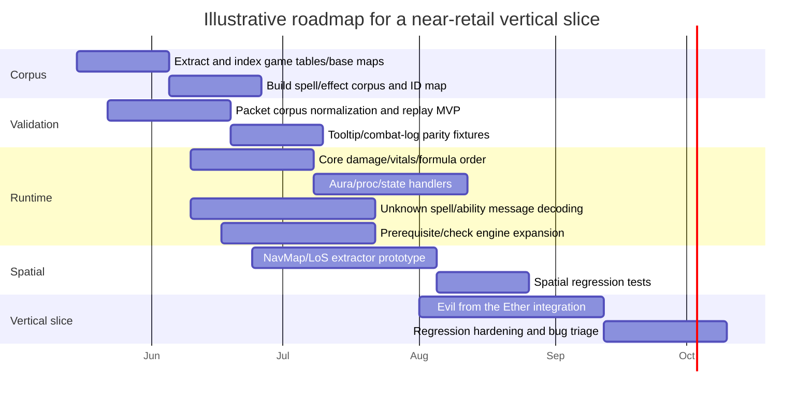

# Deep Research on WildStar NexusForever Spell Runtime Reverse Engineering

## Executive summary

NexusForever publicly targets **WildStar build 16042**, explicitly described as the **final patch**, and the main repository states that **`game_rework`** is the active development branch while `master` is the stable release branch. Public binary releases are old, but the project’s current reality is visible in the active branch, open issues/PRs, and the newer GitBook documentation, not in the historical 2021 binaries. citeturn81view0turn77view2turn77view1turn75view0

The public status page still shows a project far from full retail parity: **0/46 complete instances**, **1/46 playable instance**, and **45/46 not working**. The only publicly marked playable instance is **Evil from the Ether** in normal mode, which makes it the best documented candidate for a vertical-slice push toward a “near-retail” playable state. citeturn82view0

The core technical conclusion is straightforward: the project is not primarily blocked by “missing dungeon scripts.” It is blocked by the absence of a sufficiently accurate **generic gameplay runtime**: **spell/effect dispatch**, **prerequisites/checks**, **damage/vitals formula order**, **network spell/ability message decoding**, and **NavMap/LoS**. Public issues and PRs point to those exact areas: **Spell Rework**, **unknown spell messages**, **prerequisite implementation**, **Armor Pierce order**, and **NavMap area/mesh extraction for navigation and LoS**. citeturn78view0turn77view0turn77view1turn80view0

For a practical path to “playable close to last retail,” the most defensible plan is a **vertical-slice strategy**: stabilize one instance, one bounded set of effect families, one narrow combat formula corpus, one spatial solution for LoS/pathing, and one repeatable sniff-based validation harness. Because **Evil from the Ether** is already publicly listed as playable, it is the strongest target for this first high-fidelity slice. citeturn82view0turn78view3turn78view1

## Public NexusForever architecture

The public architecture is already substantial, and it matters because spell runtime work will land across **repositories**, **branches**, **services**, and **extracted data pipelines**, not in a single code file.

| Public component | Current public posture | Why it matters for spell/effect reverse engineering |
|---|---|---|
| `NexusForever` core repo | Main emulator codebase; `game_rework` is the active development branch | Core spell runtime, handlers, messaging, combat formulas, services |
| `NexusForever.WorldDatabase` | Separate repo for optional world data | Entity placement, splines, stats, creature scaffolding for effect validation |
| `NexusForever.Wiki` / GitBook-backed docs | Documentation source behind emulator.ws | Install, extraction, project status, service topology |
| `NexusForever.Launcher` | Separate public launcher repo | Repeatable client boot path for integration tests |
| `NexusForever.ClientConnector` | Maintained in the base repo | Developer-focused local client connection path |
| Runtime services | Auth, STS, World, Chat, Group, CharacterAPI | Spell validation eventually crosses service boundaries and world-state transitions |
| Infra layer | Entity Framework + MySQL/MariaDB; Rebus + RabbitMQ/Azure Service Bus | Reproducible local stack for deterministic testing |
| Public sniffs portal | Linked from docs navigation | Publicly acknowledged sniff corpus entry point, though scope/access is not fully documented |

The table above is grounded in the main repo README, the branches page, the client connection guide, the WorldDatabase repo/docs, the GitBook/Wiki wiring, and the `.NET Aspire` installation page. The core repo explicitly identifies `game_rework` as the active branch; the docs identify separate launcher and connector paths; the `.NET Aspire` guide exposes the service layout and infrastructure; and the docs navigation publicly links a dedicated sniffs portal. citeturn81view0turn77view2turn58view1turn59view2turn32view0turn78view4turn79view0turn60view0

Two architecture details matter especially for spell work. First, this is a **multi-service server**, not a toy single-process emulator. Second, the project already has a formal **asset extraction pipeline** from the retail client. That means the right long-term design is not “hardcode spells until it works”; it is “rebuild the interpreter that executes retail data correctly.” citeturn78view2turn78view3turn79view0

## Evidence base and assumptions

The evidence base is uneven. Some things are well documented publicly; others are only implied; some are assumptions that need confirmation from Discord, private sniffs, or unpublished code.

| Data source | Public access or extraction path | What it can tell you | Status in this review |
|---|---|---|---|
| Client game tables `*.tbl` and localization `*.bin` | Extract via `NexusForever.MapGenerator --extract` from retail client | Canonical spell/item/quest-oriented data corpus | Publicly documented |
| Spell tables and `Spell4Effects` | Likely contained within extracted game tables | Spell definitions, effect rows, parameters, cross-table IDs | **Assumption** on exact schema naming in reviewed docs |
| Base maps `*.nfmap` | Generate via `NexusForever.MapGenerator --generate` | Grid, zone, terrain height, map topology baseline | Publicly documented |
| World DB SQL dumps | Separate `NexusForever.WorldDatabase` repo | Entity placements, entity splines, stats, creature scaffolding | Publicly documented |
| Retail sniffs | Public sniffs portal is linked; world data repo confirms sniff ingestion | Packet truth for messages, timings, outcomes, world reconstruction | Publicly evidenced, full corpus access **unclear** |
| GitHub issues / PRs / branch state | Core GitHub repo | Current gaps, workstreams, dependency clues | Publicly documented |
| Decompiled client | Not documented in reviewed official sources | Function names, conditions, tooltip logic, hidden checks | **Assumption / likely internal artifact** |
| Rawaho NavMap / LoS prototype code | Not public in reviewed sources | Potential shortcut for spatial stack | **Assumption / private artifact** |

The public docs are strongest on **client extraction**, **base map generation**, and **service/runtime setup**. They explicitly say WildStar uses **client-side game tables** for things like **items, quests, spells**, and that NexusForever uses this information too. They also document generated **base maps** as containing **grid, zone, and terrain height** data. Meanwhile, the WorldDatabase repo explicitly says its initial files were created with a **custom tool that ingested sniffs taken while retail was still live**. citeturn78view2turn78view3turn78view1

The biggest documentation gap is the one you care about most: I did **not** find a public, official, exhaustive schema reference for **`Spell4Effects`** or a public catalogue of spell/effect handler classes in the reviewed sources. The sources confirm the **existence of a spell-heavy runtime problem**, but not the full internal mapping from game-table rows to server handler families. That missing map should be treated as the primary research gap rather than something you can infer safely from names alone. citeturn78view0turn77view1turn78view2

## Dependency model and gap analysis

The subsystem dependencies below are a synthesis of the public backlog, the extraction pipeline, and WildStar’s documented retail mechanics. They are analytical, but they align closely with the public evidence.

```mermaid
flowchart LR
    GT[Client game tables\n.tbl / spells / effects] --> SR[Spell runtime\n(effect dispatcher + formulas)]
    SR --> PR[Prerequisites / checks]
    PR --> AMP[AMPs]
    PR --> PATH[PlayerPath / content gating]
    GT --> MSG[Ability / spell / unit messages]
    MSG --> SR
    NAV[Base maps + NavMap/LoS] --> SR
    NAV --> AI[AI / encounter execution]
    SR --> AI
    SR --> TOOLTIP[Tooltip + combat-log parity]
    SNIFF[Retail sniffs] --> MSG
    SNIFF --> SR
    SNIFF --> TOOLTIP
    DCLIENT[Decompiled client\nassumption] --> PR
    DCLIENT --> TOOLTIP
    DCLIENT --> SR
```

WildStar retail strongly couples **movement**, **telegraphs**, and **directional combat**, and its raids were heavily built around telegraph mechanics. Public NexusForever sources, meanwhile, expose work on **Spell Rework**, **Prerequisites**, **AMP spell binding**, **PlayerPath**, **unknown spell messages**, and **NavMap/LoS**. Taken together, that makes the dependency graph above the most plausible public model: spells sit in the middle; prerequisites/checks gate them; Paths and AMPs depend on those checks; AI and encounter logic depend on spatial correctness; and retail sniffs plus client behavior are the only serious validation layer. citeturn83view0turn78view0turn77view0turn77view1turn80view0

| Missing feature or gap | Gameplay impact | Estimated effort | Priority | Why it should move now |
|---|---|---|---|---|
| Generic spell/effect dispatcher parity | Critical | Very high | Immediate | Everything else rides on it |
| Unknown spell / ability message decoding | Critical | High | Immediate | Blocks faithful replay and debugging |
| Prerequisite / checks coverage | High | High | Immediate | Gating for spells, AMPs, Paths, interactions |
| Damage / vitals / mitigation order | Critical | Medium-high | Immediate | “Looks right” is not retail parity |
| NavMap / LoS extraction | Critical for PvE | Very high | Immediate | Needed for targeting, AI, encounter integrity |
| AMP spell binding and progression | Medium-high | Medium | Near-term | Retail class behavior depends on it |
| PlayerPath integration | Medium | Medium | Near-term | Retail content identity depends on it |
| AI / encounter orchestration on top of spells | Critical for instances | Very high | Near-term | Required for the target instance |
| Broad instance scripting coverage | High | Very high | Later | Should follow generic runtime stability |

This prioritization is directly supported by the public issue and PR surface: **Issue #475** for spell rework and damage/tooltips/vitals, **Issue #464** for Navigation/LoS maps, **PR #554** and **PR #466** for prerequisites/checks, **PR #489** for unknown spell messages, **PR #455** for spell/effects like stealth/cooldown/force remove, **PR #557** for Armor Pierce order, and the status page showing only one playable instance. citeturn78view0turn77view0turn77view1turn80view0turn82view0

## Missing handler families and validation strategy

No public source reviewed here exposes an exhaustive “missing handler list.” The matrix below therefore groups handlers into **families** inferred from the public backlog and from WildStar’s retail mechanics.

| Handler family | Complexity | Required inputs | Best validation method | Likely pitfalls |
|---|---|---|---|---|
| Direct damage, heal, resource, vitals | Medium | Spell rows, coefficients, target filters, retail combat examples, tooltip captures | Unit tests + combat golden fixtures + tooltip parity checks | Wrong mitigation order, wrong rounding, mismatch between server result and client tooltip text |
| Buffs, debuffs, stat mods, periodic auras | High | Effect rows, stacking flags, duration/tick settings, proc conditions | Unit tests + state-transition tests + replay of sniffed applications/removals | Hidden stacking rules, snapshot vs dynamic scaling, aura refresh semantics |
| Crowd control, stealth, movement, cooldown manipulation | High | State flags, immunity/interrupt rules, prerequisite checks, retail edge cases | Unit tests + PvE/PvP scenario tests + replay around cast interruption and expiry | Immunity windows, break-on-damage rules, desync with client state indicators |
| Telegraph, projectile, ground-area, cone/line volume effects | Very high | Shape params, targeting rules, terrain/LoS/nav data, retail positioning examples | Spatial integration tests + replay with coordinates + instance scenario tests | Terrain clipping, wrong origin/orientation, server/client disagreement on hit volumes |
| Trigger/proc/meta-effects | Very high | Event hooks, proc masks, cooldown groups, damage-source attribution | Property-based tests + combat replay + trigger-chain logging | Infinite loops, duplicate proc firing, incorrect source attribution |
| Summons, pets, transforms, vehicles, attach/detach effects | Very high | Spawn rows, attachment rules, entity state, spline/nav data | Integration tests with entity lifecycle + replay of attach/detach flows | Ownership bugs, stale references, motion state inheritance, visibility issues |
| Teleport, interact, UI/world-state effects | High | Destination IDs, prerequisites, world-state transitions, packet examples | Integration tests + replay from interactions + map transition assertions | Wrong prerequisite gating, partial state updates, UI packet mismatch |
| Encounter-orchestration effects used by AI/boss logic | Extreme | Everything above + nav/LoS + timing + state machine clues from retail behavior | Vertical-slice instance replay + deterministic scenario harness | Script appears correct but fails because one lower-level family is slightly wrong |

This family grouping reflects the public shape of the work. The spell backlog explicitly includes **tooltips**, **damage calculations**, and **vitals**; open PRs reference **unknown spell messages**, **stealth/cooldown/force remove**, **AMPs**, and **PlayerPath**; and WildStar retail mechanics make **telegraphs**, **movement**, and **raid interaction volumes** central. That combination is why direct numeric handlers come first, spatial handlers come second, and orchestration handlers come last. citeturn78view0turn80view0turn83view0

The most important methodological point is this: **every handler family should be implemented with a test oracle before it is scaled out**. Do not treat a decompiled interpretation, or a guessed handler name, as truth. Treat it as a hypothesis, then validate it against **unit tests**, **sniff replay**, and **instance-level deterministic scenarios**. citeturn0academia3turn4academia10

## Tooling and methods

| Problem | Recommended tool or method | Expected output | Main caveat |
|---|---|---|---|
| Native client reverse engineering | Ghidra as the default native RE workbench, with local symbol/comment database and scripted annotation passes | Decompiler hypotheses, cross-references, structure guesses, function clustering | Decompiler output is not source truth |
| Packet inspection and corpus building | Wireshark + TShark + a custom export/dissector workflow for WildStar packets | Searchable packet corpus and replay fixtures | Unknown message formats still need manual decoding |
| Behavior-first validation | Sniff replay harness with assertions on packets, state deltas, and outcomes | Reproducible “retail says X” checks | Requires enough good-quality retail captures |
| Data mining from retail client | Automated indexing/diffing of extracted `.tbl`, `.bin`, and `.nfmap` corpora | Cross-table IDs, change maps, effect family corpus | Public docs do not expose full schema commentary |
| Formula verification | Tooltip screenshot corpus + combat logs + property-based tests | Damage/vitals parity and order-of-operations checks | Tooltips can encode client-only presentation quirks |
| NavMesh / LoS | Custom geometry extractor from client assets feeding a Recast/Detour-style mesh or equivalent server mesh + ray/segment occlusion tests | Server-side navigation zones and line-of-sight checks | Extraction pipeline is the hard part, not the generic navmesh library |
| Encounter regression | Deterministic vertical-slice harness for Evil from the Ether | A stable first “retail-ish” playability target | Fails if lower-level spatial or message assumptions are still wrong |

The public issue tracker says you need an **area and mesh extractor** for **Navigation and LoS maps**, while the current public docs only document **base maps**. That strongly argues for a two-stage spatial method: keep `.nfmap` as the terrain/grid baseline, then add a second extractor that emits reusable collision/nav primitives for pathing and visibility. For client reverse engineering, Ghidra is a sensible baseline because it is a mature native reverse-engineering tool with decompiler and scripting support; for packets, Wireshark/TShark remains the obvious corpus and filter layer. The most important method choice, however, is not the tool but the rule: **decompiler output must be behaviorally validated**, because execution-based checks consistently matter more than “readable pseudocode.” citeturn77view0turn78view3turn4search0turn4search4turn0academia3turn4academia10

## Roadmap to a first near-retail playable instance

The right target is not “all content.” It is **one credible vertical slice**. Public status already makes the choice easy: **Evil from the Ether** is the only instance publicly marked **Playable**, so it is the best candidate for a first “retail-adjacent” quality bar. It likely already sits nearest the current integration frontier, even before considering any private work you may have access to. citeturn82view0

The slice should be defined narrowly. Exit criteria should include: **stable login and world entry**, **correct prerequisite gating for key interactions**, **a bounded set of spell/effect families with retail-like outcomes**, **working LoS/nav/path constraints for at least the target encounter area**, **decoded critical spell/ability messages**, and **one replayable regression harness built from sniff truth plus targeted client evidence**. If those conditions are met, one instance becomes a real platform for scaling outward instead of a one-off script pile. citeturn78view0turn77view0turn77view1turn78view1



This timeline is intentionally illustrative, not predictive. The public evidence suggests the ordering, not the exact duration: **game tables and spatial extraction first**, **message and formula parity next**, **prerequisites in parallel**, and then **instance hardening** on **Evil from the Ether**. If you gain access to private NavMap work or a richer private sniff corpus, that should pull the spatial and replay phases forward immediately. citeturn78view2turn78view3turn78view1turn82view0turn77view0

## Discord search checklist and artifact requests

Because the public docs do not expose a full `Spell4Effects` guide or a complete handler inventory, Discord becomes most valuable when it fills **specific missing links**, not when it adds more general discussion. Search for names that already appear in the public backlog, then request artifacts that can become tests.

| Search keyword | Why it matters | Best artifact to request |
|---|---|---|
| `Spell Rework` | Direct public workstream for runtime parity | Branch names, design notes, handler TODO lists |
| `spells-v2-gr` | Explicit branch named in spell issue | Commit references, rebasing notes, screenshots |
| `Spell4Effects` | Core effect-row semantics | Row dumps, field annotations, example ID mappings |
| `tooltips` | Publicly flagged as important for damage calculations | Screenshot pairs: tooltip + observed combat outcome |
| `damage calculation` | Central runtime parity area | Formula notes, retail examples, coefficient tables |
| `vitals` | Explicit part of spell rework issue | Health/resource state transitions and edge cases |
| `unknown spell messages` | Public PR says many are still unknown | Packet captures with field notes and decoded guesses |
| `Prerequisite` / `Checks` | Separate active workstream | Check ID lists, guessed semantics, failing examples |
| `Armor Pierce` | Public combat-order PR | Before/after logs, mitigation math, retail comparisons |
| `AMP` | Public PRs tie AMPs to spells | Unlock events, IDs, spell casts on learn |
| `PlayerPath` | Public PR track exists | Path-specific gating cases, content unlock examples |
| `NavMap` / `LoS` / `mesh extractor` | Publicly acknowledged missing spatial layer | Branch names, screenshots, serialized mesh samples |
| `Evil from the Ether` | Publicly best vertical slice target | Walkthrough captures, boss packets, known blockers |
| `ability messages` / `opcodes` / `movement messages` | Message-surface decoding work is active | Opcode maps, packet legends, dissector scripts |

The ideal Discord artifact is not prose. It is a **bundle**: one or more **packet captures**, the relevant **spell/effect IDs**, a **client screenshot or short retail video**, any **decompiler annotation**, and a one-line **behavioral claim** such as “effect X should apply before mitigation” or “check Y gates teleport option Z.” That is the fastest path from Discord knowledge to automated regression tests. The keyword list above is derived directly from the public issue and PR tracker, plus the project status page and the one publicly playable instance. citeturn78view0turn77view0turn77view1turn80view0turn82view0