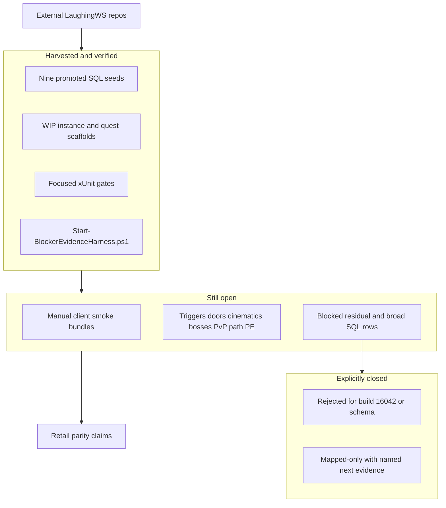

# LaughingWS Audit: Remaining Unimplemented and Blocked Work

**Canonical trackers (all updated 2026-05-27):**
- [Decomp/Analysis/LAUGHINGWS_REMAINING_BLOCKERS_CLOSURE_MATRIX.md](Decomp/Analysis/LAUGHINGWS_REMAINING_BLOCKERS_CLOSURE_MATRIX.md) — per-task end state (LWS-036 through LWS-125)
- [Decomp/Analysis/LAUGHINGWS_REMAINING_BLOCKERS_IMPLEMENTATION_PLAN.md](Decomp/Analysis/LAUGHINGWS_REMAINING_BLOCKERS_IMPLEMENTATION_PLAN.md) — milestone checklist (unchecked items = open gates)
- [Decomp/Analysis/LAUGHINGWS_WORLDDB_AND_MORE_AUDIT.md](Decomp/Analysis/LAUGHINGWS_WORLDDB_AND_MORE_AUDIT.md)
- [Decomp/Analysis/LAUGHINGWS_QUESTING_AND_MORE_AUDIT.md](Decomp/Analysis/LAUGHINGWS_QUESTING_AND_MORE_AUDIT.md)
- [Decomp/Analysis/LAUGHINGWS_INSTANCES_AND_MORE_AUDIT.md](Decomp/Analysis/LAUGHINGWS_INSTANCES_AND_MORE_AUDIT.md)
- [CURRENT_STATUS.md](CURRENT_STATUS.md) and [Decomp/Analysis/MISSING_FEATURE_MATRIX.md](Decomp/Analysis/MISSING_FEATURE_MATRIX.md) (F-004, F-009, F-014, F-022, F-024, F-029)

> **Note:** An older plan at [.cursor/plans/laughingws_remaining_work_b6af037a.plan.md](.cursor/plans/laughingws_remaining_work_b6af037a.plan.md) is stale (e.g. it still lists eight `extract_additive_world_overlay` files and Deradune/Ellevar checklist promotion). Row review closed those; the audit bucket is now **0** files.

---

## What is already done (not “left” except smoke)

| Track | Status |
| --- | --- |
| **WorldDB intake** | Analyzer + nine idempotent seeds (`map_entrance`, city, Dust Stalker, small-world, instance-entity, live-event, Skyplot, store catalog, quest loot); setup import + `verify_safe_world_imports.sql`; **0** unsupported schema targets; **0** `extract_additive_world_overlay` files |
| **Row reconciliation** | Milestone 1 complete: Algoroc, Celestion, Galeras, Thayd, Whitevale, Deradune, Ellevar + residual zones reviewed — **0** promotable rows from those queues |
| **Questing branch** | Housing/transporters, many quest helpers, path episode activation, Settler acks, Explorer progress, `character_path_mission` persistence (partial) |
| **Instances branch** | Conservative map/event scaffolds for PvP, expeditions, dungeons, raids; SQL boss objective-credit hooks |
| **Verification discipline** | LWS-120–125 closed; seeds SHA-256 match; focused tests: path `56/56`, PvP `29/29`, expedition `75/75`, dungeon `149/149`, raid/event `169/169` |
| **Evidence harness** | LWS-070: [Decomp/Analysis/Start-BlockerEvidenceHarness.ps1](Decomp/Analysis/Start-BlockerEvidenceHarness.ps1) creates bundles — **content smoke not yet captured** |

**Manual client smoke was not run** for instance/zone/event parity. Automated tests prove scaffold wiring, not retail behavior.

---

## A. Explicitly rejected (do not implement for current target)

| ID | Item | Reason |
| --- | --- | --- |
| LWS-043 | 23 sandbox/test/unknown/not-in-client zone files (`2,786` rows) | [LAUGHINGWS_SANDBOX_ZONE_ASSET_PROOF_CHECKLIST.md](Decomp/Analysis/LAUGHINGWS_SANDBOX_ZONE_ASSET_PROOF_CHECKLIST.md) — needs per-file client-asset proof |
| LWS-044 | Dominion/Exile arkship tutorial (`43` rows) | Build 16042 uses Rider's Reef/surface starts |
| LWS-045 | Rider's Reef `New Tutorial.sql` (`38` rows) | Superseded by official NPE import |
| LWS-050 | Dungeon Chase SMC item `86919` (type `0`) | Cannot fit `store_offer_item_data.itemId` / 15-bit `ServerStoreOffers`; verified by `LaughingWsStoreCatalogSeedTests` |
| LWS-076 | Unused branch `PublicEventCreature` / communicator catalogs | No active runtime consumer |
| LWS-090 | Outpost M-13 shuttle trigger id `5` | Zero-vector, no world-location proof |

Direct import of the LaughingWS world DB checkout, `All in one` dumps, DDL/`@GUID`/destructive deletes, and runtime queries against `wildstar_client`/`jabbithole`/`nf_map_*` remain rejected per audit rules.

---

## B. WorldDB: data promoted but behavior unproven (WIP/GUESSED)

These rows **exist in seeds** but audits block retail-complete claims until harness smoke (LWS-036–037, 051–055, 053–054):

| Slice | Rows / scope | Blocked until |
| --- | --- | --- |
| **City/checklist** (LWS-036–037) | Ringo Hax, Thayd/Illium housing panels, Auroria/Crimson/Levian/Everstar/Wilderrun/Northern Wilds checklist updates | [LAUGHINGWS_CITY_CHECKLIST_SMOKE_GATE_REVIEW.md](Decomp/Analysis/LAUGHINGWS_CITY_CHECKLIST_SMOKE_GATE_REVIEW.md) |
| **Dust Stalker Q4516** (LWS-051) | 3 entities + Boss Xagg stats; exit panel source-only | Self-destruct/escape timing, exit panel — [LAUGHINGWS_DUST_STALKER_Q4516_REVIEW.md](Decomp/Analysis/LAUGHINGWS_DUST_STALKER_Q4516_REVIEW.md) |
| **Arcterra/Palaver** (LWS-052) | 3 source-only small-world rows | Placement, portal, Ish'amel quest — [LAUGHINGWS_ARCTERRA_PALAVER_SOURCE_ONLY_REVIEW.md](Decomp/Analysis/LAUGHINGWS_ARCTERRA_PALAVER_SOURCE_ONLY_REVIEW.md) |
| **Skyplot housing** (LWS-053) | 411 rows | Vendor, return-pad, lifecycle — [LAUGHINGWS_SKYPLOT_HOUSING_REVIEW.md](Decomp/Analysis/LAUGHINGWS_SKYPLOT_HOUSING_REVIEW.md) |
| **Live events** (LWS-054) | 440 rows | Per-event spawn/vendor/lifecycle — [LAUGHINGWS_LIVE_EVENT_SMOKE_REVIEW.md](Decomp/Analysis/LAUGHINGWS_LIVE_EVENT_SMOKE_REVIEW.md) |
| **Quest virtual loot** (LWS-055) | 7,650 rows | Trigger cadence, probability, corpse selection — [LAUGHINGWS_QUEST_VIRTUAL_LOOT_REVIEW.md](Decomp/Analysis/LAUGHINGWS_QUEST_VIRTUAL_LOOT_REVIEW.md) |
| **Instance entity seed** | 75 entities + events/scripts/stats; Evil drive sparks; Datascape anchors | Triggers, doors, cinematics, boss mechanics, Evil residuals, Init Core Y-83 zero-coord SQL |

---

## C. WorldDB: SQL intentionally not promoted (blocked residuals)

Row-level review found **no further promotable rows** from former overlay buckets. Remaining branch SQL stays audit-only:

| Bucket | Approx. scale | Examples |
| --- | --- | --- |
| **New zones** (LWS-040–042) | Dreadmoor 1,256; Halon 1,692; Murkmire 841 insert rows | [LAUGHINGWS_NEW_ZONE_BROAD_ROW_REVIEW.md](Decomp/Analysis/LAUGHINGWS_NEW_ZONE_BROAD_ROW_REVIEW.md) — destructive deletes, mostly zero-coord placeholders |
| **Zone residuals** | Hundreds of queue rows per zone | `blocked_laughingws_*_residual_rows` for Algoroc, Celestion, Galeras, Whitevale, Deradune, Ellevar, Thayd vendors, Levian Bay, Everstar, Auroria, Crimson Isle, Northern Wilds splines, Wilderrun Dorian |
| **Datascape mechanics** | Hydroflux/Mnemesis only in rejected all-in-one dumps | `HydrofluxLogicAndWaterEntityScript`, `MnemesisLogicAndWaterEntityScript` — blocked until decompile + smoke |
| **Evil from the Ether residuals** | 44 of 55 branch-only entities | No runtime hook beyond 11 drive sparks |
| **Init Core Y-83 SQL entities** | Zero-coordinate, no events/scripts | Raid script scaffold exists; SQL rows not seeded |

---

## D. Questing-and-more: runtime still incomplete

| ID | Area | Implemented (partial) | Still blocked |
| --- | --- | --- | --- |
| LWS-060 | Path persistence | `character_path_mission`, login replay | Active path object-ids, reward history, negative reload/path/faction cases |
| LWS-061 | Path rewards | `GameFormula` 0x017a XP fallback, mission grants | Exact per-mission precision, presentation, overflow |
| LWS-062 | Path unlock sequencing | Table-backed filters + unit tests | Client-smoked filtering, replay ordering, zone reload |
| LWS-063 | Settler hub | Build-count progress persists | Built-group identity, resources, avenues, failure packets |
| LWS-064 | Settler/Soldier packets | `ProgressCount`/`ProgressData`, packet field names | Holdout waves, failure ordering, resource costs, durable built state |
| LWS-065 | Path edge tests | **Closed** — 56/56 | — |
| LWS-066 | Fortune | Current implementation works | Retail weights/rotations need `ServerFortuneRewards` or storefront dump |

---

## E. Shared public-event infrastructure (LWS-071–075)

Scaffolds and **packet-shape** progress exist; **behavior is mapped-only**:

- **Votes** (071): opcodes `0x06F7`, `0x0139` shaped — lifecycle/tally/timeout unimplemented
- **Scoreboards/rewards** (072): `0x06FA`, `0x0130`, `0x00D6`, `0x013B` shaped — population, tiers, delivery blocked
- **Objective notifications** (073), **triggers/doors** (074), **cinematics/communicators** (075): blocked pending proof

See [LAUGHINGWS_SHARED_PUBLIC_EVENT_BLOCKER_REVIEW.md](Decomp/Analysis/LAUGHINGWS_SHARED_PUBLIC_EVENT_BLOCKER_REVIEW.md).

---

## F. Instances-and-more: scaffolds vs retail behavior

All listed content has **WIP-guessed scripts + focused tests**; **manual smoke and choreography remain blocked** (reviews under `Decomp/Analysis/LAUGHINGWS_*_SMOKE_REVIEW.md`):

| Milestone | IDs | Content | Main gaps |
| --- | --- | --- | --- |
| PvP/Adventure | 080–085 | Cryo-Plex, Daggerstone, Halls, Walatiki, War of the Wilds, Rage Logic | Queue/match, scoring, rewards, stats, faction events 170/171, vehicle routing |
| Expeditions | 091–096 | Space Madness, Fragment Zero, Gauntlet, Infestation, Evil, Deep Space | Real cinematics, trigger timing, doors, boss cadence, Evil residuals |
| Dungeons | 100–106 | Coldblood, Protogames, Kel Voreth, Stormtalon, Skullcano, Sanctuary, UP dungeon | Route weights, boss mechanics, communicator timing, real cinematic payloads |
| Raids/Events | 110–117 | Init Core Y-83, Red Moon, Genetic Archives, Datascape, UP raid, Shade's Eve, SuperMall, OMNICore | Hydroflux/Mnemesis, weekly selection, doors/elevators, vote follow-up, store routing |

Cross-cutting for all instance work: trigger coordinates, door ids, phase timing, optional objective weights, entity cleanup, and completion-only cinematic placeholders (no actor/camera/text data in branch).

---

## G. Recommended execution order

1. **Capture smoke bundles** (unblocks LWS-036–037, 051–055, 053–054, and all instance milestones): use `Start-BlockerEvidenceHarness.ps1` with the per-review recipes; start with highest player-facing WIP seeds (housing Skyplot, one live event, Dust Stalker, one dungeon + one raid).
2. **Close city/checklist WIP labels** only where smoke passes; convert audit rows from WIP/GUESSED to implemented or rejected.
3. **Path/Fortune depth** (060–064, 066): only after packet captures or decompile proof — avoid widening behavior from branch guesses.
4. **Public-event shared layer** (071–075): implement vote/scoreboard/reward flows only when packet/UI sequence is proven.
5. **Per-instance depth** (080–117): boss mechanics, route randomization, real cinematics — one instance at a time post-smoke.
6. **Do not pursue** rejected buckets (043–045, 050, 076, 090, broad new zones, sandbox files) unless scope explicitly changes (e.g. pre-16042 target, schema widening for SMC `86919`, sandbox investigation).

---

## Summary counts

| State | Meaning | Approx. task IDs |
| --- | --- | --- |
| **Implemented + verified** | Done | LWS-065, 070, 120–125; LWS-050 rejection verified |
| **Partially implemented** | Code exists; blockers named | LWS-060–064, 071–072 (packet shape only) |
| **Mapped-only / smoke-blocked** | Data or scaffold only | LWS-036–037, 040–042, 051–055, 053–054, 066, 071–075, 080–085, 091–096, 100–106, 110–117 |
| **Rejected** | Do not implement for 16042 | LWS-043–045, 050, 076, 090 |

**Bottom line:** LaughingWS **intake and conservative ports are largely complete**. What remains is overwhelmingly **evidence-gated runtime behavior** (smoke, packets, decompile) plus **~7k+ blocked SQL rows** that row review deliberately did not promote. No broad LaughingWS SQL should be imported without row-level proof.
